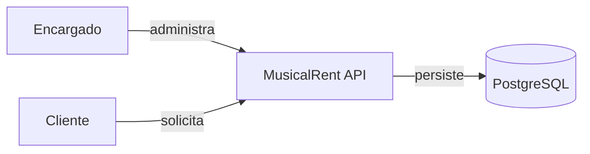
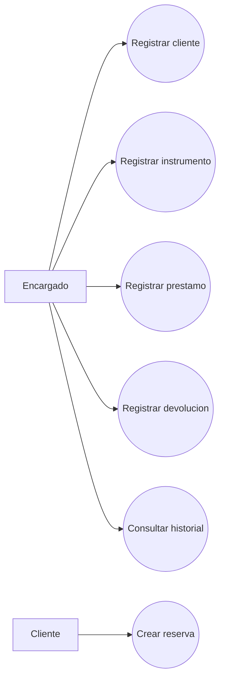
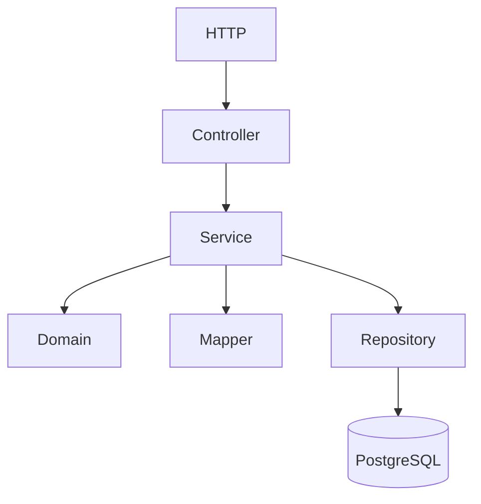
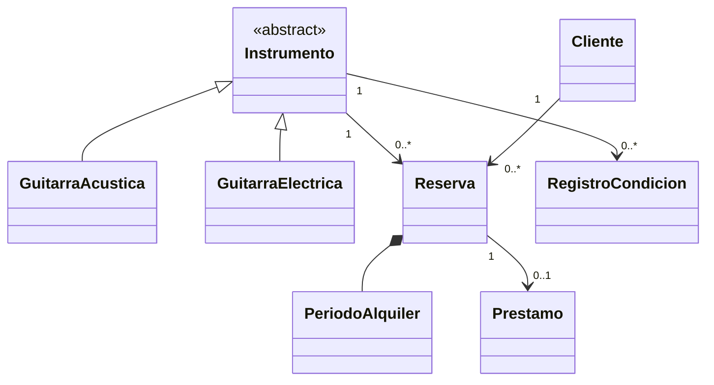
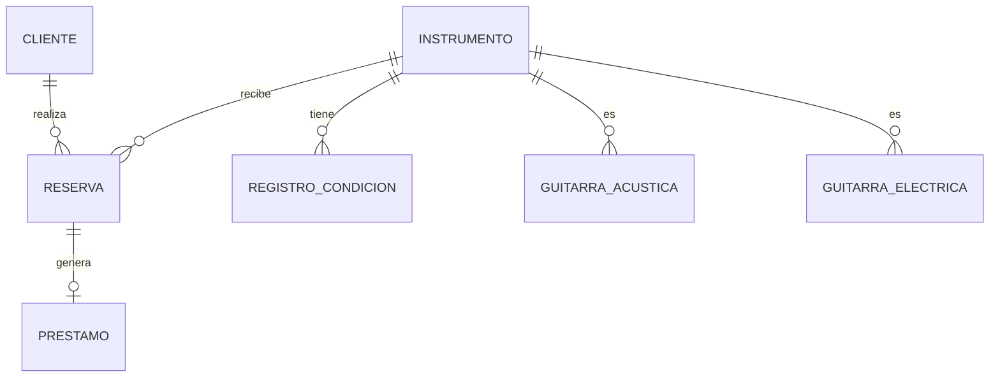
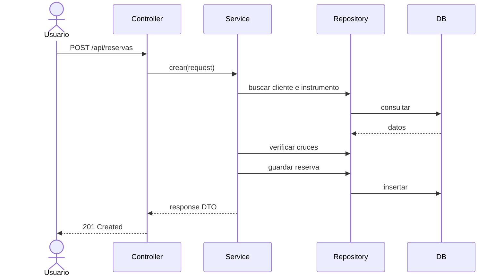
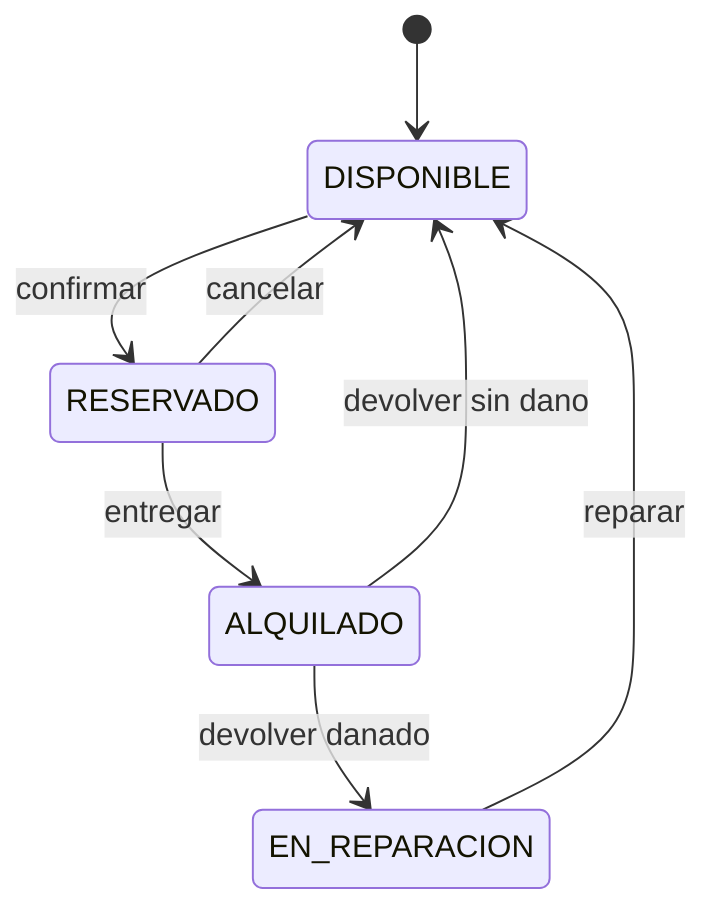
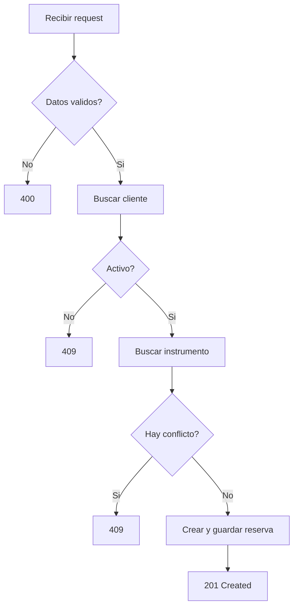
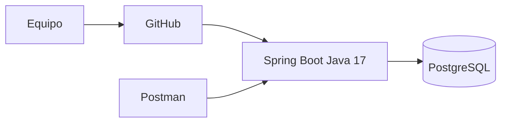
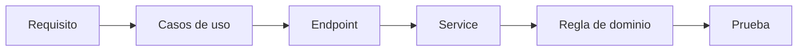

# MusicalRent API
## Especificacion, arquitectura y plan de construccion

**Version:** 1.0 - estructura ordenada
**Estado:** Documento de trabajo antes de implementar codigo
**Repositorio:** `musical-rent-api`
**Tecnologia principal:** Java 17 + Spring Boot + PostgreSQL

---

# Como leer este documento

Este documento se lee de arriba hacia abajo. El orden es intencional:

```text
1. Entender el problema
2. Definir el alcance
3. Definir requisitos y reglas
4. Modelar el dominio
5. Diseñar la arquitectura
6. Diseñar la base de datos
7. Definir contratos REST
8. Planear la implementacion
9. Definir pruebas y calidad
10. Preparar la entrega
```

No se debe saltar directamente a crear entidades o controllers. Cada etapa depende de la anterior.

Regla principal:

> Ningun codigo se considera terminado si no tiene una razon documentada, una prueba y una relacion con un requisito.

---

# Parte I - Identidad y contexto

## 1. Integrantes

- Steven Eraso Insuasty
- Sebastian Manchabajoy Rosero
- Hector Alejandro Riascos Insuasty

## 2. Nombre y proposito

**MusicalRent API** es una API REST para administrar el alquiler de instrumentos musicales, principalmente guitarras.

El sistema permitira conocer:

- Que instrumentos existen.
- Que tipo de instrumento es cada uno.
- Si esta disponible, reservado, alquilado o en reparacion.
- En que condicion fisica se encuentra.
- Quien lo tiene.
- Cuando fue entregado.
- Cuando debe devolverse.
- En que condicion se entrego.
- En que condicion se devolvio.
- Que historial ha tenido.

## 3. Problema que se quiere resolver

Una tienda puede perder el control cuando registra los alquileres manualmente. Los problemas principales son:

- Reservar un instrumento que ya esta ocupado.
- No saber quien tiene un instrumento.
- No recordar cuando debe devolverse.
- No conocer el estado fisico anterior.
- No distinguir entre un instrumento disponible y uno en reparacion.
- Perder el historial de danos.
- Permitir que datos internos sean modificados desde la API.

MusicalRent centraliza esa informacion y protege las reglas del negocio.

## 4. Pregunta central

> Como puede una tienda controlar de forma segura que instrumento tiene disponible, quien lo reserva, quien lo recibe, en que condicion se entrega y en que condicion se devuelve?

---

# Parte II - Alcance

## 5. Alcance del MVP

La primera version incluye:

1. Registrar clientes.
2. Consultar clientes.
3. Registrar guitarras acusticas.
4. Registrar guitarras electricas.
5. Consultar instrumentos.
6. Filtrar instrumentos.
7. Crear reservas.
8. Confirmar reservas.
9. Cancelar reservas.
10. Registrar prestamos.
11. Registrar entregas.
12. Registrar devoluciones.
13. Guardar condiciones fisicas.
14. Consultar historial de condiciones.
15. Actualizar instrumentos parcialmente.
16. Evitar reservas cruzadas.
17. Validar requests.
18. Devolver errores uniformes.
19. Probar las reglas principales.

## 6. Fuera del MVP

No se implementan inicialmente:

- Pagos en linea.
- Facturacion.
- Login.
- Roles avanzados.
- Notificaciones.
- Aplicacion movil.
- Microservicios.
- Inteligencia artificial.
- Integraciones externas.
- Event sourcing.

Estas funcionalidades solamente se discutiran despues de terminar el MVP.

## 7. Actores

### 7.1 Encargado

Administra clientes, inventario, reservas, entregas, devoluciones y reparaciones.

### 7.2 Cliente

Persona que solicita y recibe un instrumento. En el MVP se representa como una entidad del sistema; no necesariamente tiene cuenta de usuario.

### 7.3 Base de datos

Sistema externo donde se guardan los datos persistentes.

---

# Parte III - Requisitos

## 8. Requisitos funcionales

### RF-001 - Registrar cliente

El sistema debe registrar nombre, numero de identificacion y celular.

Aceptacion:

- La identificacion es obligatoria.
- La identificacion es unica.
- El cliente inicia activo.
- Los datos invalidos producen `400 Bad Request`.
- Un duplicado produce `409 Conflict`.

### RF-002 - Consultar cliente

Debe poder consultarse por UUID y listar clientes.

### RF-003 - Registrar instrumento polimorfico

El request debe tener un discriminador `tipo`.

Valores iniciales:

```text
GUITARRA_ACUSTICA
GUITARRA_ELECTRICA
```

El mapper debe crear la clase concreta correspondiente.

### RF-004 - Consultar inventario

Debe permitir consultar por:

- Tipo.
- Estado de disponibilidad.
- Condicion fisica.
- Codigo de inventario.

### RF-005 - Crear reserva

Debe recibir cliente, instrumento y periodo.

Debe comprobar:

- Cliente existente.
- Cliente activo.
- Instrumento existente.
- Instrumento no enviado a reparacion.
- Fechas validas.
- Ausencia de reservas cruzadas.

### RF-006 - Confirmar reserva

Una reserva pendiente valida puede confirmarse. Al confirmarse, el instrumento pasa a `RESERVADO`.

### RF-007 - Cancelar reserva

Una reserva cancelada no puede confirmarse. La politica sobre cancelar reservas confirmadas debe aprobarse antes de implementar.

### RF-008 - Entregar instrumento

Solo una reserva confirmada puede producir un prestamo. La entrega registra fecha y condicion inicial.

### RF-009 - Devolver instrumento

La devolucion registra fecha, condicion final y observaciones. El instrumento pasa a disponible o reparacion.

### RF-010 - Historial

Cada cambio de condicion crea un registro nuevo y no elimina registros anteriores.

### RF-011 - Actualizacion parcial

`PATCH` modifica solo los campos enviados. Los campos ausentes no deben convertirse en `null`.

### RF-012 - Consultar prestamos

Debe poder consultarse prestamos activos, devueltos y atrasados.

## 9. Requisitos no funcionales

### RNF-001 - Mantenibilidad

El sistema debe separar Controller, Service, Repository, Domain, DTO y Mapper.

### RNF-002 - Comprensibilidad

Los nombres de clases, metodos y atributos deben explicar su responsabilidad.

### RNF-003 - Seguridad

No se deben exponer entidades JPA ni permitir modificar identidad, historial o estados protegidos desde cualquier request.

### RNF-004 - Integridad

Una operacion que modifica varias entidades debe ejecutarse dentro de una transaccion.

### RNF-005 - Pruebas

Las reglas criticas deben tener pruebas automatizadas.

### RNF-006 - Portabilidad

El proyecto debe incluir instrucciones para levantarlo en otra maquina.

### RNF-007 - Evolucion

Agregar otro tipo de instrumento no debe exigir reescribir todas las capas.

---

# Parte IV - Reglas del negocio

## 10. Reglas del cliente

- Nombre obligatorio.
- Identificacion obligatoria y unica.
- Celular obligatorio.
- Cliente activo por defecto.
- Un cliente inactivo no puede reservar.
- Las penalizaciones se gestionan con metodos de dominio.
- Al alcanzar el limite definido, el cliente puede quedar inactivo.
- `reactivar()` debe restablecer la capacidad de reservar.

Estas reglas pertenecen al dominio propio de MusicalRent: las penalizaciones protegen la responsabilidad del cliente y los metodos de dominio controlan si puede solicitar nuevos prestamos.

## 11. Reglas del instrumento

- Codigo de inventario obligatorio y unico.
- Marca y modelo obligatorios.
- Precio diario no negativo.
- Estado inicial `DISPONIBLE`.
- Un instrumento en reparacion no puede reservarse.
- Un instrumento alquilado no puede alquilarse otra vez.
- No se modifica el estado con setters publicos genericos.
- Las transiciones se realizan mediante metodos de dominio.

## 12. Reglas de reserva

- Cliente obligatorio.
- Instrumento obligatorio.
- Periodo obligatorio.
- Cliente activo.
- Fechas validas.
- Sin cruces de fechas.
- Estado inicial `PENDIENTE`.
- Una reserva cancelada no puede confirmarse.
- Al confirmar, el instrumento pasa a `RESERVADO`.
- Al finalizar el prestamo, la reserva pasa a `FINALIZADA`.

## 13. Reglas del prestamo

- Solo nace desde una reserva confirmada.
- Un instrumento solo puede tener un prestamo activo.
- La entrega registra condicion inicial.
- La devolucion registra condicion final.
- Un prestamo devuelto no puede devolverse otra vez.
- Una devolucion sin dano deja el instrumento disponible.
- Una devolucion danada puede enviarlo a reparacion.

## 14. Regla de cruce de fechas

Dos periodos se cruzan si:

```text
nuevoInicio < existenteFin
Y
nuevoFin > existenteInicio
```

Debe probarse con periodos separados, iguales, contenidos, adyacentes y parcialmente superpuestos.

## 15. Estados

### 15.1 Disponibilidad

```text
DISPONIBLE
RESERVADO
ALQUILADO
EN_REPARACION
```

### 15.2 Condicion fisica

```text
NUEVO
USADO
RAYADO
DANADO
```

### 15.3 Reserva

```text
PENDIENTE -> CONFIRMADA -> FINALIZADA
PENDIENTE -> CANCELADA
CONFIRMADA -> CANCELADA   [solo si la politica lo permite]
```

### 15.4 Prestamo

```text
ACTIVO -> DEVUELTO
ACTIVO -> ATRASADO -> DEVUELTO
```

`ATRASADO` puede calcularse al consultar:

```text
estado == ACTIVO
Y
ahora > fechaDevolucionEsperada
```

Se debe decidir si se persiste o se calcula. Para el MVP se recomienda calcularlo en lectura.

---

# Parte V - Modelo de dominio

## 16. Conceptos de ingenieria aplicados

MusicalRent se diseña como un proyecto independiente. Sus decisiones nacen del problema de alquiler de instrumentos, no de copiar clases, nombres o reglas de otro sistema.

Los conceptos que se aplicaran son:

- Programacion orientada a objetos.
- Encapsulamiento de estados y reglas.
- Abstraccion mediante `Instrumento`.
- Herencia entre `Instrumento` y sus tipos concretos.
- Polimorfismo en requests, responses y mappers.
- Objetos de valor para periodos.
- DTOs para contratos HTTP.
- MapStruct para conversion entre objetos.
- Repository Pattern para persistencia.
- Service Layer para casos de uso.
- Inyeccion de dependencias.
- Arquitectura REST.
- JPA y Hibernate.
- Herencia relacional `JOINED`.
- Transacciones.
- Validacion.
- Excepciones especificas.
- Proyecciones anidadas sin recursion.
- Actualizaciones parciales seguras.
- Pruebas unitarias e integracion.

Cada concepto se justifica por una necesidad concreta del negocio musical.

## 17. Cliente

Representa a quien alquila.

Atributos:

```text
UUID id
String nombre
String numeroIdentificacion
String celular
String email
boolean activo
int penalizaciones
```

Comportamientos:

```text
registrarPenalizacion()
reactivar()
puedeRealizarReservas()
```

## 18. Instrumento abstracto

Representa los datos comunes:

```text
UUID id
String codigoInventario
String marca
String modelo
BigDecimal precioDiario
EstadoDisponibilidad estadoDisponibilidad
CondicionFisica condicionActual
LocalDateTime fechaRegistro
Long version
```

Debe ser abstracta porque no se debe crear un instrumento sin especificar su clase concreta.

Metodos esperados:

```text
reservar()
alquilar()
devolver()
enviarAReparacion()
reparar()
```

## 19. GuitarraAcustica

Hereda de `Instrumento`.

```text
int numeroCuerdas
String tipoMadera
boolean tienePastilla
```

## 20. GuitarraElectrica

Hereda de `Instrumento`.

```text
int numeroCuerdas
String tipoCuerpo
int numeroPastillas
```

## 21. PeriodoAlquiler

Objeto de valor y posible `@Embeddable record`:

```text
LocalDateTime fechaInicio
LocalDateTime fechaDevolucion
```

Debe validar fechas y calcular dias.

## 22. Reserva

```text
UUID id
Cliente cliente
Instrumento instrumento
PeriodoAlquiler periodo
EstadoReserva estado
LocalDateTime fechaCreacion
BigDecimal costoTotal
```

El costo se calcula con:

```text
precioDiario * diasFacturables
```

Debe definirse si un periodo de cero dias cobra minimo un dia. Esa decision pertenece a la politica de alquiler de MusicalRent y debe quedar registrada antes de programar.

## 23. Prestamo

```text
UUID id
Reserva reserva
LocalDateTime fechaEntregaReal
LocalDateTime fechaDevolucionReal
CondicionFisica condicionAlEntregar
CondicionFisica condicionAlDevolver
String observacionesEntrega
String observacionesDevolucion
EstadoPrestamo estado
```

## 24. RegistroCondicion

```text
UUID id
Instrumento instrumento
CondicionFisica condicion
String observaciones
LocalDateTime fechaRegistro
MomentoCondicion momento
```

Momentos:

```text
REGISTRO_INICIAL
ENTREGA
DEVOLUCION
INSPECCION
REPARACION
```

---

# Parte VI - Arquitectura

## 25. Arquitectura por capas

```text
Cliente HTTP
    |
    v
Controller
    |
    v
Service
    |
    v
Repository
    |
    v
PostgreSQL
```

DTOs y mappers protegen los limites:

```text
JSON -> Request DTO -> Controller -> Service -> Mapper -> Domain
Domain -> Mapper -> Response DTO -> Controller -> JSON
```

## 26. Responsabilidad por capa

### Controller

Recibe HTTP, valida entrada, delega y responde. No contiene reglas complejas ni llama repositorios directamente.

### Service

Representa casos de uso, coordina objetos y controla transacciones.

### Domain

Protege reglas, estados e invariantes. No conoce HTTP.

### Repository

Consulta y guarda datos. No decide si una reserva es valida.

### Mapper

Convierte DTOs y entidades. No guarda ni valida reglas de negocio.

### DTO

Define el contrato externo y evita exponer entidades JPA.

## 27. Principios de diseño

- Responsabilidad unica.
- Bajo acoplamiento.
- Alta cohesion.
- Encapsulamiento.
- Abstraccion.
- Herencia.
- Polimorfismo.
- Inversion de dependencias.
- Sustitucion de Liskov.
- Fail fast.
- Separacion de responsabilidades.

## 28. Patrones

- MVC adaptado a REST.
- Repository Pattern.
- Service Layer.
- Data Mapper.
- Dependency Injection.
- Domain Model.
- Value Object.
- Unit of Work implicito de Hibernate.
- Identity Map implicito de Hibernate.

No se agregan Factory, Strategy, CQRS o microservicios sin una necesidad real.

---

# Parte VII - Persistencia

## 29. Tecnologias

- Java 17.
- Spring Boot.
- Spring Web.
- Spring Data JPA.
- Hibernate.
- PostgreSQL.
- MapStruct.
- Maven.
- JUnit 5.
- Mockito.
- Bean Validation.

## 30. Herencia JPA

Usar:

```java
@Inheritance(strategy = InheritanceType.JOINED)
```

Tablas esperadas:

```text
instrumento
instrumento_guitarra_acustica
instrumento_guitarra_electrica
```

La tabla padre guarda campos comunes y las tablas hijas los campos especificos.

## 31. Relaciones

Debe documentarse y probarse:

- `Cliente` uno a muchos `Reserva`.
- `Instrumento` uno a muchos `Reserva`.
- `Reserva` uno a uno o uno a cero/uno `Prestamo`.
- `Instrumento` uno a muchos `RegistroCondicion`.
- `Reserva` contiene `PeriodoAlquiler`.

Se recomienda evaluar:

```java
@ManyToOne(fetch = FetchType.LAZY, optional = false)
```

No usar `cascade` u `orphanRemoval` sin justificarlo. Las entidades deben tener constructor vacio `protected` para Hibernate.

## 32. Repositories esperados

```text
ClienteRepository.findByNumeroIdentificacion(...)
InstrumentoRepository.findByCodigoInventario(...)
InstrumentoRepository.findByEstadoDisponibilidad(...)
ReservaRepository.findByClienteId(...)
ReservaRepository.findByInstrumentoId(...)
PrestamoRepository.findByEstado(...)
RegistroCondicionRepository.findByInstrumentoIdOrderByFechaRegistroDesc(...)
```

La consulta de cruces de fechas puede usar JPQL, consulta nativa o Specification, pero debe tener pruebas de casos limite.

## 33. Configuracion

Ejemplo local:

```properties
spring.application.name=musical-rent
spring.datasource.url=${DB_URL:jdbc:postgresql://localhost:5432/musical_rent_db}
spring.datasource.username=${DB_USERNAME:postgres}
spring.datasource.password=${DB_PASSWORD:postgres}
spring.datasource.driver-class-name=org.postgresql.Driver
spring.jpa.hibernate.ddl-auto=update
spring.jpa.show-sql=true
spring.jpa.properties.hibernate.format_sql=true
```

No subir secretos reales. Para produccion se deben usar variables de entorno y migraciones como Flyway o Liquibase.

## 34. Maven

El `pom.xml` debe incluir:

- `spring-boot-starter-web`.
- `spring-boot-starter-data-jpa`.
- `spring-boot-starter-validation`.
- Driver PostgreSQL.
- MapStruct y su processor.
- `spring-boot-starter-test`.
- Java 17.
- Maven Compiler Plugin.
- Spring Boot Maven Plugin.

Comandos:

```powershell
./mvnw.cmd compile
./mvnw.cmd test
./mvnw.cmd spring-boot:run
```

---

# Parte VIII - Diagramas

## 35. Contexto



## 36. Casos de uso



## 37. Componentes



## 38. Clases



## 39. Entidad-relacion



## 40. Secuencia de reserva



## 41. Estados



## 42. Actividad de reserva



## 43. Despliegue



## 44. Trazabilidad



---

# Parte IX - Contratos REST

## 45. Convenciones HTTP

- `GET` consulta.
- `POST` crea o ejecuta una accion.
- `PATCH` actualiza parcialmente.
- `200 OK` consulta u operacion exitosa.
- `201 Created` creacion exitosa.
- `204 No Content` exito sin cuerpo.
- `400 Bad Request` datos invalidos.
- `404 Not Found` recurso inexistente.
- `409 Conflict` duplicado o conflicto de disponibilidad.

Al crear un recurso, devolver `Location`.

## 46. Rutas

### Clientes

```text
POST   /api/clientes
GET    /api/clientes
GET    /api/clientes/{id}
PATCH  /api/clientes/{id}
```

### Instrumentos

```text
POST   /api/instrumentos
GET    /api/instrumentos
GET    /api/instrumentos/{id}
PATCH  /api/instrumentos/{id}
GET    /api/instrumentos/{id}/historial-condiciones
```

### Reservas

```text
POST   /api/reservas
GET    /api/reservas
GET    /api/reservas/{id}
POST   /api/reservas/{id}/confirmar
POST   /api/reservas/{id}/cancelar
```

### Prestamos

```text
POST   /api/prestamos
GET    /api/prestamos
GET    /api/prestamos/{id}
POST   /api/prestamos/{id}/devolver
GET    /api/prestamos/activos
GET    /api/prestamos/atrasados
```

## 47. Crear instrumento polimorfico

```json
{
  "tipo": "GUITARRA_ACUSTICA",
  "codigoInventario": "GTR-001",
  "marca": "Yamaha",
  "modelo": "FG800",
  "precioDiario": 25000,
  "numeroCuerdas": 6,
  "tipoMadera": "ABETO",
  "tienePastilla": false
}
```

## 48. Crear reserva

```json
{
  "clienteId": "uuid",
  "instrumentoId": "uuid",
  "fechaInicio": "2026-10-10T09:00:00",
  "fechaDevolucion": "2026-10-15T17:00:00"
}
```

## 49. Actualizacion parcial

```json
{
  "precioDiario": 30000,
  "condicionActual": "RAYADO"
}
```

Usar `NullValuePropertyMappingStrategy.IGNORE`. No permitir cambiar desde PATCH:

- `id`.
- `tipo`.
- `codigoInventario`.
- `fechaRegistro`.
- `version`.
- Historial.

## 50. Respuesta anidada sin recursion

```json
{
  "id": "uuid",
  "estado": "CONFIRMADA",
  "cliente": {
    "id": "uuid",
    "nombre": "Laura Gomez"
  },
  "instrumento": {
    "id": "uuid",
    "codigoInventario": "GTR-001",
    "tipo": "GUITARRA_ACUSTICA"
  },
  "fechaInicio": "2026-10-10T09:00:00",
  "fechaDevolucion": "2026-10-15T17:00:00"
}
```

Los DTOs resumidos no deben contener sus relaciones inversas.

## 51. Formato de error

```json
{
  "timestamp": "2026-10-02T10:00:00Z",
  "status": 409,
  "error": "CONFLICT",
  "message": "El instrumento ya esta reservado para ese periodo",
  "path": "/api/reservas"
}
```

---

# Parte X - Implementacion por fases

## 52. Fase 0 - Acuerdo del equipo

Antes de codigo, aprobar:

- Nombres.
- Estados.
- Politica de fechas.
- Costo minimo.
- Penalizaciones.
- Cancelacion.
- Prestamo atrasado.
- Reparacion.
- Autenticacion fuera del MVP.

Entregable: acta de decisiones en este documento.

## 53. Fase 1 - Proyecto base

Crear Spring Boot con Java 17, Maven, dependencias, PostgreSQL, MapStruct y prueba de contexto.

Validacion:

```powershell
./mvnw.cmd compile
./mvnw.cmd test
```

## 54. Fase 2 - Dominio sin HTTP

Crear en este orden:

1. Enums.
2. `PeriodoAlquiler`.
3. `Cliente`.
4. `Instrumento`.
5. `GuitarraAcustica`.
6. `GuitarraElectrica`.
7. `Reserva`.
8. `Prestamo`.
9. `RegistroCondicion`.

Primero probar constructores, invariantes y transiciones.

## 55. Fase 3 - Persistencia

Agregar JPA, relaciones, `JOINED`, repositorios, restricciones y configuracion.

Validar esquema y consultas.

## 56. Fase 4 - DTOs y MapStruct

Crear requests, responses, resumenes, mapper polimorfico, mapper de listas y mapper de PATCH.

No aceptar advertencias de propiedades no mapeadas sin justificar.

## 57. Fase 5 - Services

Implementar casos de uso en este orden:

1. Clientes.
2. Instrumentos.
3. Reservas.
4. Confirmacion.
5. Cancelacion.
6. Entrega.
7. Devolucion.
8. Historial.
9. PATCH.

Usar `@Transactional` para escritura y `@Transactional(readOnly = true)` para lectura.

## 58. Fase 6 - Controllers

Crear rutas, `@RequestBody`, `@Valid`, `@PathVariable`, `ResponseEntity`, `201` y `Location`.

## 59. Fase 7 - Errores y seguridad

Crear excepciones especificas y `@RestControllerAdvice`.

No devolver stack traces al cliente.

## 60. Fase 8 - Pruebas y documentacion

Completar pruebas, README, Postman, diagramas, variables de entorno y guia de ejecucion.

---

# Parte XI - Pruebas y calidad

## 61. Pruebas unitarias

Probar sin Spring:

- Cliente invalido.
- Penalizacion.
- Reactivacion.
- Precio negativo.
- Fechas invalidas.
- Estados imposibles.
- Costo total.
- Cruce de fechas.
- Devolucion danada.

## 62. Pruebas de mapper

- Request acustico crea clase acustica.
- Request electrico crea clase electrica.
- Response conserva tipo.
- Campos especificos no se pierden.
- PATCH con null conserva datos.
- Listas se mapean.
- Campos ignorados no se sobrescriben.

## 63. Pruebas de service

- Cliente inexistente.
- Instrumento inexistente.
- Cliente inactivo.
- Reserva cruzada.
- Confirmacion valida.
- Cancelacion invalida.
- Entrega sin reserva.
- Doble devolucion.

## 64. Pruebas de repository

- Codigo unico.
- Identificacion unica.
- Busqueda por estado.
- Cruces de fechas.
- Historial ordenado.
- Prestamos activos.

## 65. Pruebas de controller

Verificar ruta, JSON, validacion, codigo HTTP, `Location` y formato de error.

## 66. Prueba de contexto

Debe existir una prueba equivalente a:

```java
@SpringBootTest
class MusicalRentApplicationTests {

    @Test
    void contextLoads() {
    }
}
```

La prueba debe ejecutarse con una base de test controlada, no depender por accidente de la base personal de un integrante.

## 67. Definition of Done

Una funcionalidad esta terminada solo cuando tiene:

- Requisito.
- Regla de negocio.
- Codigo.
- Validacion.
- Excepcion.
- Mapper si aplica.
- Endpoint si aplica.
- Prueba.
- Ejemplo JSON.
- Documentacion.
- Commit.

---

# Parte XII - Trabajo colaborativo

## 68. Responsabilidades

### Steven

Instrumentos, herencia, polimorfismo y mapper de instrumentos.

### Sebastian

Clientes, periodos, reservas y proyecciones anidadas.

### Hector

Prestamos, devoluciones, historial, PATCH, excepciones y pruebas de integracion.

Todos deben conocer el sistema completo.

## 69. Ramas

```text
main
develop
feature/clientes
feature/instrumentos
feature/reservas
feature/prestamos
feature/pruebas
feature/documentacion
```

## 70. Commits

```text
feat: agrega entidad instrumento
feat: agrega mapper polimorfico
fix: evita reservas cruzadas
test: agrega pruebas de devolucion
docs: actualiza contrato de reservas
refactor: separa excepciones de dominio
```

## 71. Checklist de pull request

- [ ] El requisito esta identificado.
- [ ] El codigo compila.
- [ ] Las pruebas pasan.
- [ ] No hay secretos.
- [ ] No se exponen entidades.
- [ ] No hay cambios ajenos.
- [ ] El documento fue actualizado.
- [ ] El autor puede explicar el cambio.

---

# Parte XIII - Trazabilidad y decisiones

## 72. Matriz de trazabilidad

| Requisito | Caso de uso | Endpoint o clase | Prueba | Estado |
|---|---|---|---|---|
| RF-001 | Registrar cliente | `POST /api/clientes` | Cliente valido | Pendiente |
| RF-003 | Registrar instrumento | `POST /api/instrumentos` | Mapper polimorfico | Pendiente |
| RF-005 | Crear reserva | `POST /api/reservas` | Cruce de fechas | Pendiente |
| RF-006 | Confirmar reserva | `/confirmar` | Transicion de estado | Pendiente |
| RF-008 | Entregar | `POST /api/prestamos` | Prestamo activo | Pendiente |
| RF-009 | Devolver | `/devolver` | Condicion final | Pendiente |
| RF-010 | Historial | `/historial-condiciones` | Registro historico | Pendiente |
| RF-011 | PATCH | `PATCH /api/instrumentos/{id}` | Null ignore | Pendiente |

## 73. ADR-001 - Arquitectura por capas

**Contexto:** HTTP, negocio y persistencia tienen responsabilidades diferentes.

**Decision:** usar Controller, Service, Repository, Domain, DTO y Mapper.

**Consecuencia:** mas clases, pero menor acoplamiento y mejores pruebas.

## 74. ADR-002 - DTOs

**Contexto:** las entidades tienen relaciones y datos internos.

**Decision:** nunca devolver entidades directamente.

**Consecuencia:** se necesita MapStruct, pero se protege el contrato.

## 75. ADR-003 - Herencia JOINED

**Contexto:** los instrumentos comparten atributos y tienen campos especificos.

**Decision:** usar tabla padre y tablas por subtipo.

**Consecuencia:** el modelo representa polimorfismo y requiere consultas cuidadosas.

## 76. ADR-004 - BigDecimal

**Contexto:** el dinero no debe sufrir errores binarios de `double`.

**Decision:** usar `BigDecimal`.

**Consecuencia:** definir escala, redondeo y moneda.

## 77. ADR-005 - Historial inmutable

**Contexto:** la condicion actual no explica el pasado.

**Decision:** cada cambio crea un registro nuevo.

**Consecuencia:** mas registros, pero trazabilidad completa.

---

# Parte XIV - Documentacion y entrega

## 78. README obligatorio

Debe incluir:

- Descripcion.
- Requisitos previos.
- Instalacion.
- Configuracion de PostgreSQL.
- Variables de entorno.
- Comandos Maven.
- Como ejecutar pruebas.
- Endpoints.
- Ejemplos JSON.
- Diagramas o enlace al plan.
- Integrantes.
- Limitaciones.

## 79. Glosario minimo

- **API:** interfaz para comunicarse con el sistema.
- **DTO:** objeto de transporte de datos.
- **Entidad:** objeto con identidad persistente.
- **Mapper:** transformador entre objetos.
- **Repository:** acceso abstracto a datos.
- **Service:** caso de uso.
- **Controller:** entrada HTTP.
- **Dominio:** reglas del negocio.
- **Invariante:** regla que siempre debe mantenerse.
- **Polimorfismo:** tratar subtipos mediante un tipo comun.
- **ORM:** mapeo objeto-relacional.
- **Transaccion:** unidad de trabajo atomica.
- **PATCH:** actualizacion parcial.
- **Proyeccion:** seleccion de datos necesarios.

## 80. Checklist final

- [ ] El problema esta explicado.
- [ ] El alcance esta cerrado.
- [ ] Los requisitos tienen identificadores.
- [ ] Las reglas tienen pruebas.
- [ ] Los diagramas coinciden con el codigo.
- [ ] La herencia funciona.
- [ ] El mapper conserva subtipos.
- [ ] Los DTOs no exponen entidades.
- [ ] PATCH ignora null.
- [ ] Las reservas cruzadas se rechazan.
- [ ] Las transacciones estan definidas.
- [ ] Los errores tienen formato uniforme.
- [ ] PostgreSQL esta documentado.
- [ ] Maven compila.
- [ ] Las pruebas pasan.
- [ ] El README permite ejecutar el proyecto.
- [ ] Los tres integrantes pueden explicar el sistema.

---

# Parte XV - Contratos internos y documentacion detallada

## 81. DTOs obligatorios

### Requests

- `CrearClienteRequest`.
- `ActualizarClienteRequest`.
- `CrearInstrumentoRequest`.
- `ActualizarInstrumentoRequest`.
- `CrearReservaRequest`.
- `CrearPrestamoRequest`.
- `DevolverPrestamoRequest`.

### Responses

- `ClienteResponse`.
- `InstrumentoResponse`.
- `ReservaResponse`.
- `ReservaDetalleResponse`.
- `PrestamoResponse`.
- `ClienteResumenResponse`.
- `InstrumentoResumenResponse`.
- `HistorialCondicionResponse`.

No se deben devolver entidades JPA desde un controller.

## 82. Metodos esperados de MapStruct

```text
ClienteMapper.toResponse(Cliente)
ClienteMapper.toResponseList(List<Cliente>)
ClienteMapper.toEntity(CrearClienteRequest)
InstrumentoMapper.toGuitarraAcustica(CrearInstrumentoRequest)
InstrumentoMapper.toGuitarraElectrica(CrearInstrumentoRequest)
InstrumentoMapper.toResponse(GuitarraAcustica)
InstrumentoMapper.toResponse(GuitarraElectrica)
InstrumentoMapper.updateEntity(ActualizarInstrumentoRequest, Instrumento)
ReservaMapper.toResponse(Reserva)
ReservaMapper.toResponseList(List<Reserva>)
PrestamoMapper.toResponse(Prestamo)
```

Las propiedades derivadas se deben mapear explicitamente:

```text
cliente.nombre -> cliente.nombre
instrumento.codigoInventario -> instrumento.codigoInventario
periodo.fechaInicio -> fechaInicio
periodo.fechaDevolucion -> fechaDevolucion
estado.name() -> estado
```

No se deben ignorar advertencias de MapStruct sin explicar por que el campo se ignora.

## 83. Services y controllers

### Services

```text
ClienteService.crear(...)
ClienteService.listarTodos()
ClienteService.obtenerPorId(...)
InstrumentoService.crear(...)
InstrumentoService.listar(...)
InstrumentoService.obtenerPorId(...)
ReservaService.crear(...)
ReservaService.confirmar(...)
ReservaService.cancelar(...)
PrestamoService.entregar(...)
PrestamoService.devolver(...)
```

Las escrituras usan `@Transactional`; las consultas pueden usar `@Transactional(readOnly = true)`.

### Controllers

Cada controller debe:

- Usar `@RestController`.
- Definir `@RequestMapping`.
- Recibir DTOs.
- Usar `@Valid`.
- Usar `@PathVariable` para identificadores.
- Devolver codigos HTTP correctos.
- Crear `Location` en `201 Created`.
- Delegar la logica al Service.

## 84. Excepciones y errores

Crear excepciones especificas:

- `ClienteNoEncontradoException`.
- `InstrumentoNoEncontradoException`.
- `ReservaNoEncontradaException`.
- `PrestamoNoEncontradoException`.
- `InstrumentoNoDisponibleException`.
- `RecursoDuplicadoException`.
- `ReglaDeNegocioException`.

Crear un `@RestControllerAdvice` que transforme las excepciones a:

```json
{
    "timestamp": "2026-10-02T10:00:00Z",
    "status": 409,
    "error": "CONFLICT",
    "message": "El instrumento no esta disponible",
    "path": "/api/reservas"
}
```

## 85. Como documentar cada cambio

Antes de crear o modificar una clase se debe registrar:

1. Que problema resuelve.
2. Por que existe.
3. Por que pertenece a ese paquete.
4. Que principio aplica.
5. Que datos recibe.
6. Que datos devuelve.
7. Que invariantes protege.
8. Que errores puede producir.
9. Como se prueba.

Los comentarios de codigo deben explicar decisiones, no repetir instrucciones obvias.

## 86. Criterio de independencia del proyecto

MusicalRent no reutiliza el dominio, las entidades, los nombres de tablas ni los contratos de otro sistema.

Las similitudes permitidas son unicamente tecnicas:

- Usar Spring Boot.
- Usar Java.
- Usar REST.
- Usar JPA.
- Usar repositorios.
- Usar servicios.
- Usar DTOs.
- Usar MapStruct.
- Usar transacciones.
- Usar pruebas.

La justificacion de cada clase debe salir de una necesidad de la tienda musical.

---

# Parte XVI - Estado y proximo paso

## 87. Estado actual

- Esta es la unica especificacion oficial del proyecto.
- El documento anterior fue eliminado para evitar duplicidad.
- La especificacion ordenada esta escrita.
- Todavia no se ha creado codigo de aplicacion.
- El repositorio es `musical-rent-api`.

## 88. Proximo paso

El equipo debe revisar y aprobar las decisiones de la seccion 52. Despues se crea el proyecto Spring Boot y se ejecuta la primera validacion:

```powershell
./mvnw.cmd compile
```

No se deben crear todas las entidades en una sola tanda. La primera sesion de codigo debe explicar y construir los enums, y validar que el proyecto base compile.
