# MusicalRent API

## Plan maestro del proyecto

Sistema académico para gestionar clientes, instrumentos musicales, reservas, prestamos, devoluciones y condiciones fisicas.

Este documento es la memoria principal del proyecto. Debe conservarse aunque se cierre el chat o se cambie de asistente.

> **Regla de trabajo:** este documento es la fuente de verdad del proyecto. Toda decision importante debe explicarse aqui antes de convertirse en codigo. Si una implementacion contradice este documento, primero se actualiza la decision y luego se modifica el codigo.

## Indice maestro

1. [Identidad y alcance](#1-integrantes)
2. [Objetivo academico](#3-objetivo-academico)
3. [Arquitectura](#5-arquitectura)
4. [Modelo de dominio](#7-modelo-de-dominio)
5. [Plan de fases](#20-plan-de-trabajo-por-fases)
6. [Especificacion completa de ingenieria](#31-especificacion-completa-de-ingenieria)
7. [Requisitos funcionales](#32-requisitos-funcionales)
8. [Requisitos no funcionales](#33-requisitos-no-funcionales)
9. [Actores y casos de uso](#34-actores-y-casos-de-uso)
10. [Diagramas](#35-diagramas-de-ingenieria)
11. [Modelo de datos](#36-modelo-de-datos-relacional)
12. [Contratos REST](#37-contratos-de-la-api-rest)
13. [Flujos de negocio](#38-flujos-de-negocio)
14. [Seguridad y confiabilidad](#39-seguridad-y-confiabilidad)
15. [Estrategia de pruebas](#40-estrategia-de-pruebas)
16. [Documentacion del codigo](#41-reglas-para-documentar-el-codigo)
17. [Plan de ejecucion](#42-plan-de-ejecucion-didactico)
18. [Trazabilidad y calidad](#43-trazabilidad-y-calidad)
19. [Glosario](#44-glosario)

---

## 1. Integrantes

- Steven Eraso Insuasty
- Sebastian Manchabajoy Rosero
- Hector Alejandro Riascos Insuasty

---

## 2. Idea del proyecto

MusicalRent sera una API REST para una tienda de alquiler de instrumentos musicales, principalmente guitarras.

El sistema permitira:

- Registrar clientes.
- Registrar instrumentos.
- Identificar el tipo concreto de instrumento.
- Consultar disponibilidad.
- Crear reservas.
- Confirmar y cancelar reservas.
- Crear prestamos a partir de reservas confirmadas.
- Registrar el estado fisico del instrumento al entregarlo.
- Registrar el estado fisico al devolverlo.
- Mantener historial de condiciones.
- Consultar prestamos activos y atrasados.
- Actualizar instrumentos parcialmente sin sobrescribir datos accidentalmente.
- Evitar reservas que se crucen en fechas.

El sistema debe permitir al dueño conocer:

- Que instrumentos existen.
- En que estado de disponibilidad se encuentran.
- En que condiciones fisicas se encuentran.
- Quien tiene cada instrumento.
- Cuando fue entregado.
- Cuando debe ser devuelto.
- Que ocurrio con el instrumento antes y despues del prestamo.

---

## 3. Objetivo academico

Aplicar en un solo proyecto los siguientes conceptos:

- Java 17.
- Programacion orientada a objetos.
- Encapsulamiento.
- Abstraccion.
- Herencia.
- Polimorfismo.
- Clases abstractas.
- Enums.
- Records.
- Objetos de valor.
- Reglas de negocio.
- Arquitectura por capas.
- Spring Boot.
- API REST.
- DTOs de entrada y salida.
- MapStruct.
- Spring Data JPA.
- Hibernate.
- PostgreSQL.
- Herencia JPA con `JOINED`.
- Relaciones entre entidades.
- Transacciones.
- Validacion.
- Manejo global de errores.
- Proyecciones anidadas sin recursion.
- Actualizacion parcial segura con `PATCH`.
- Pruebas unitarias.
- Pruebas de integracion.
- Documentacion tecnica.
- Trabajo colaborativo con Git.

---

## 4. Alcance del MVP

La primera version debe incluir unicamente lo necesario para demostrar el dominio del problema y los temas vistos en clase.

### Incluido

1. Clientes.
2. Instrumentos.
3. Guitarras acusticas.
4. Guitarras electricas.
5. Reservas.
6. Prestamos.
7. Devoluciones.
8. Condiciones fisicas.
9. Historial de condiciones.
10. Actualizacion parcial de instrumentos.
11. Filtros basicos de instrumentos.
12. Validacion y errores.
13. Pruebas automatizadas.
14. Documentacion y ejemplos de uso.

### No incluido inicialmente

- Pagos en linea.
- Usuarios y autenticacion.
- Roles avanzados.
- Facturacion.
- Notificaciones por correo.
- Aplicacion movil.
- Integracion con proveedores externos.
- Microservicios.
- Event sourcing.
- Inteligencia artificial.

Estas funcionalidades solo se evaluaran despues de terminar y probar el MVP.

---

## 5. Arquitectura

Se utilizara una arquitectura por capas:

```text
Cliente HTTP
    |
    v
Controller
    |
    v
Service
    |
    v
Repository
    |
    v
PostgreSQL
```

Los DTOs y mappers participan en los limites de la aplicacion:

```text
JSON de entrada
    |
    v
Request DTO
    |
    v
Controller
    |
    v
Service
    |
    v
Mapper
    |
    v
Entidad de dominio
    |
    v
Repository
```

Para una respuesta:

```text
Entidad de dominio
    |
    v
Mapper
    |
    v
Response DTO
    |
    v
JSON de salida
```

### Responsabilidades

#### Controller

- Recibir solicitudes HTTP.
- Convertir parametros y JSON en DTOs.
- Delegar en el servicio.
- Devolver codigos HTTP y respuestas.
- No contener reglas complejas de negocio.
- No acceder directamente al repositorio.

#### Service

- Representar casos de uso.
- Coordinar entidades y repositorios.
- Ejecutar reglas de aplicacion.
- Controlar transacciones.
- Lanzar excepciones de negocio.

#### Domain

- Representar el negocio.
- Proteger invariantes.
- Contener estados y comportamientos.
- Evitar setters publicos innecesarios.

#### Repository

- Consultar y guardar en la base de datos.
- No contener reglas de negocio complejas.

#### Mapper

- Convertir request DTO a entidad.
- Convertir entidad a response DTO.
- Resolver el polimorfismo.
- Evitar asignaciones repetitivas.

#### DTO

- Definir el contrato de la API.
- Evitar exponer directamente entidades JPA.
- Controlar que datos entran y salen.

---

## 6. Estructura de paquetes

```text
src/main/java/com/musicalrent
├── MusicalRentApplication.java
├── controller
├── service
├── repository
├── domain
├── dto
│   ├── request
│   └── response
├── mapper
├── exception
├── config
└── specification
```

### Proposito de cada paquete

- `domain`: entidades, enums, objetos de valor y comportamiento.
- `dto/request`: datos recibidos por la API.
- `dto/response`: datos devueltos por la API.
- `mapper`: conversion entre DTOs y entidades.
- `repository`: persistencia mediante Spring Data JPA.
- `service`: casos de uso y transacciones.
- `controller`: endpoints HTTP.
- `exception`: excepciones y manejador global.
- `config`: configuraciones de Spring.
- `specification`: filtros dinamicos si llegan a ser necesarios.

---

## 7. Modelo de dominio

### 7.1 Cliente

Clase: `Cliente`

Atributos:

- `UUID id`.
- `String nombre`.
- `String numeroIdentificacion`.
- `String celular`.
- `String email`.
- `boolean activo`.

Reglas:

- El nombre es obligatorio.
- La identificacion es obligatoria y unica.
- El celular es obligatorio.
- El email debe tener formato valido si se solicita.
- Un cliente inactivo no puede crear reservas.
- No se debe eliminar fisicamente un cliente con historial.

### 7.2 Instrumento abstracto

Clase: `Instrumento`

Debe ser abstracta y usar herencia JPA con `JOINED`.

Atributos comunes:

- `UUID id`.
- `String codigoInventario`.
- `String marca`.
- `String modelo`.
- `BigDecimal precioDiario`.
- `EstadoDisponibilidad estadoDisponibilidad`.
- `CondicionFisica condicionActual`.
- `LocalDateTime fechaRegistro`.
- `Long version` para concurrencia optimista.

Reglas:

- El codigo de inventario es obligatorio y unico.
- Marca y modelo son obligatorios.
- El precio debe ser positivo o cero segun la politica definida.
- Un instrumento en reparacion no puede reservarse.
- Un instrumento alquilado no puede volver a alquilarse.
- Las transiciones deben hacerse mediante metodos de dominio.

### 7.3 Guitarra acustica

Clase: `GuitarraAcustica extends Instrumento`

Atributos propios:

- `int numeroCuerdas`.
- `String tipoMadera`.
- `boolean tienePastilla`.

### 7.4 Guitarra electrica

Clase: `GuitarraElectrica extends Instrumento`

Atributos propios:

- `int numeroCuerdas`.
- `String tipoCuerpo`.
- `int numeroPastillas`.

### 7.5 Periodo de alquiler

Clase: `PeriodoAlquiler`

Puede ser un `record` y un `@Embeddable`.

Atributos:

- `LocalDateTime fechaInicio`.
- `LocalDateTime fechaDevolucion`.

Reglas:

- Ninguna fecha puede ser nula.
- La fecha de devolucion no puede ser anterior a la fecha de inicio.
- Debe poder calcular los dias del periodo.

### 7.6 Reserva

Clase: `Reserva`

Atributos:

- `UUID id`.
- `Cliente cliente`.
- `Instrumento instrumento`.
- `PeriodoAlquiler periodo`.
- `EstadoReserva estado`.
- `LocalDateTime fechaCreacion`.

Estados:

```text
PENDIENTE
CONFIRMADA
CANCELADA
FINALIZADA
```

Reglas:

- Debe existir cliente.
- Debe existir instrumento.
- El cliente debe estar activo.
- Las fechas deben ser validas.
- No debe existir otra reserva confirmada que se cruce.
- Una reserva cancelada no puede confirmarse.
- Al confirmar, el instrumento pasa a `RESERVADO`.

### 7.7 Prestamo

Clase: `Prestamo`

Atributos:

- `UUID id`.
- `Reserva reserva`.
- `LocalDateTime fechaEntregaReal`.
- `LocalDateTime fechaDevolucionReal`.
- `CondicionFisica condicionAlEntregar`.
- `CondicionFisica condicionAlDevolver`.
- `String observacionesEntrega`.
- `String observacionesDevolucion`.
- `EstadoPrestamo estado`.

Estados:

```text
ACTIVO
DEVUELTO
ATRASADO
```

Reglas:

- Solo una reserva confirmada puede generar un prestamo.
- Al entregar, el instrumento pasa a `ALQUILADO`.
- Un prestamo activo tiene fecha de entrega.
- Al devolver, se registra fecha y condicion.
- Un prestamo devuelto no puede devolverse otra vez.
- Si el instrumento vuelve danado, puede pasar a `EN_REPARACION`.

### 7.8 Registro de condicion

Clase: `RegistroCondicion`

Atributos:

- `UUID id`.
- `Instrumento instrumento`.
- `CondicionFisica condicion`.
- `String observaciones`.
- `LocalDateTime fechaRegistro`.
- `MomentoCondicion momento`.

Momentos:

```text
REGISTRO_INICIAL
ENTREGA
DEVOLUCION
INSPECCION
REPARACION
```

El historial debe ser acumulativo. No se debe borrar el estado anterior cuando cambia la condicion.

---

## 8. Enums

### TipoInstrumento

```text
GUITARRA_ACUSTICA
GUITARRA_ELECTRICA
```

### EstadoDisponibilidad

```text
DISPONIBLE
RESERVADO
ALQUILADO
EN_REPARACION
```

### CondicionFisica

```text
NUEVO
USADO
RAYADO
DANADO
```

### EstadoReserva

```text
PENDIENTE
CONFIRMADA
CANCELADA
FINALIZADA
```

### EstadoPrestamo

```text
ACTIVO
DEVUELTO
ATRASADO
```

### MomentoCondicion

```text
REGISTRO_INICIAL
ENTREGA
DEVOLUCION
INSPECCION
REPARACION
```

---

## 9. Polimorfismo

El cliente debe indicar el tipo concreto del instrumento.

Ejemplo de guitarra acustica:

```json
{
  "tipo": "GUITARRA_ACUSTICA",
  "codigoInventario": "GTR-001",
  "marca": "Yamaha",
  "modelo": "FG800",
  "precioDiario": 25000,
  "numeroCuerdas": 6,
  "tipoMadera": "ABETO",
  "tienePastilla": false
}
```

Ejemplo de guitarra electrica:

```json
{
  "tipo": "GUITARRA_ELECTRICA",
  "codigoInventario": "GTR-002",
  "marca": "Ibanez",
  "modelo": "GRX70",
  "precioDiario": 40000,
  "numeroCuerdas": 6,
  "tipoCuerpo": "SOLIDO",
  "numeroPastillas": 2
}
```

El mapper debe interpretar `tipo` y crear la clase correcta:

```text
GUITARRA_ACUSTICA -> GuitarraAcustica
GUITARRA_ELECTRICA -> GuitarraElectrica
```

No se deben crear controladores separados para cada subtipo.

---

## 10. DTOs

### Requests

- `CrearClienteRequest`.
- `ActualizarClienteRequest`.
- `CrearInstrumentoRequest`.
- `ActualizarInstrumentoRequest`.
- `CrearReservaRequest`.
- `CrearPrestamoRequest`.
- `DevolverPrestamoRequest`.

### Responses

- `ClienteResponse`.
- `InstrumentoResponse`.
- `ReservaResponse`.
- `ReservaDetalleResponse`.
- `PrestamoResponse`.
- `ClienteResumenResponse`.
- `InstrumentoResumenResponse`.
- `HistorialCondicionResponse`.

No se deben devolver entidades JPA directamente desde los controllers.

---

## 11. Proyecciones anidadas sin recursion

Una respuesta detallada de reserva puede incluir resumen de cliente e instrumento:

```json
{
  "id": "uuid",
  "estado": "CONFIRMADA",
  "cliente": {
    "id": "uuid",
    "nombre": "Laura Gomez",
    "numeroIdentificacion": "123456"
  },
  "instrumento": {
    "id": "uuid",
    "codigoInventario": "GTR-001",
    "tipo": "GUITARRA_ACUSTICA",
    "marca": "Yamaha",
    "modelo": "FG800"
  },
  "fechaInicio": "2026-10-10",
  "fechaDevolucion": "2026-10-15"
}
```

Reglas:

- `ClienteResumenResponse` no contiene reservas.
- `InstrumentoResumenResponse` no contiene prestamos.
- No serializar entidades JPA con relaciones completas.
- Evitar ciclos `Cliente -> Reserva -> Cliente`.
- Definir claramente la profundidad de cada respuesta.

---

## 12. Actualizacion parcial segura

Endpoint:

```text
PATCH /api/instrumentos/{id}
```

Ejemplo:

```json
{
  "precioDiario": 30000,
  "condicionActual": "RAYADO"
}
```

Los campos no enviados deben conservarse.

El request de actualizacion debe usar campos anulables:

- `String marca`.
- `String modelo`.
- `BigDecimal precioDiario`.
- `EstadoDisponibilidad estadoDisponibilidad`.
- `CondicionFisica condicionActual`.

No se deben permitir desde el PATCH:

- `id`.
- `tipo`.
- `codigoInventario`.
- `fechaRegistro`.
- `version`.
- Historial.

MapStruct debe configurarse con:

```java
NullValuePropertyMappingStrategy.IGNORE
```

Si cambia la condicion fisica, se debe crear un nuevo `RegistroCondicion`.

---

## 13. Endpoints

### Clientes

```text
POST   /api/clientes
GET    /api/clientes
GET    /api/clientes/{id}
PATCH  /api/clientes/{id}
```

### Instrumentos

```text
POST   /api/instrumentos
GET    /api/instrumentos
GET    /api/instrumentos/{id}
PATCH  /api/instrumentos/{id}
PATCH  /api/instrumentos/{id}/estado
GET    /api/instrumentos/{id}/historial-condiciones
```

Filtros:

```text
GET /api/instrumentos?estado=DISPONIBLE
GET /api/instrumentos?tipo=GUITARRA_ELECTRICA
GET /api/instrumentos?condicion=RAYADO
```

### Reservas

```text
POST   /api/reservas
GET    /api/reservas
GET    /api/reservas/{id}
POST   /api/reservas/{id}/confirmar
POST   /api/reservas/{id}/cancelar
```

### Prestamos

```text
POST   /api/prestamos
GET    /api/prestamos
GET    /api/prestamos/{id}
POST   /api/prestamos/{id}/devolver
GET    /api/prestamos/activos
GET    /api/prestamos/atrasados
```

---

## 14. Codigos HTTP

- `200 OK`: consulta u operacion exitosa.
- `201 Created`: recurso creado.
- `204 No Content`: operacion exitosa sin cuerpo.
- `400 Bad Request`: datos invalidos.
- `404 Not Found`: recurso inexistente.
- `409 Conflict`: duplicados o conflicto de disponibilidad.
- `500 Internal Server Error`: error inesperado.

Al crear recursos, devolver tambien la cabecera `Location`.

---

## 15. Reglas de negocio

1. No registrar instrumentos sin codigo.
2. No permitir codigos duplicados.
3. No permitir identificaciones duplicadas.
4. No permitir precios negativos.
5. No permitir clientes inactivos.
6. No reservar instrumentos en reparacion.
7. No reservar instrumentos alquilados en un periodo incompatible.
8. Validar siempre las fechas.
9. No permitir reservas cruzadas.
10. No confirmar reservas canceladas.
11. No crear prestamos sin reservas confirmadas.
12. No crear dos prestamos activos para el mismo instrumento.
13. Cambiar el instrumento a alquilado al entregar.
14. Cambiarlo a disponible o reparacion al devolver.
15. Registrar condicion de entrega.
16. Registrar condicion de devolucion.
17. Mantener historial de condiciones.
18. No modificar el historial desde un PATCH.
19. Usar metodos de dominio para cambiar estados.
20. No exponer entidades completas en JSON.

---

## 16. Validacion

Usar Bean Validation:

- `@NotBlank`.
- `@NotNull`.
- `@Email`.
- `@Positive`.
- `@Size`.
- `@Pattern` cuando sea necesario.
- `@Valid` en los controllers.

La validacion HTTP no reemplaza la validacion del dominio. Las entidades tambien deben proteger sus invariantes.

---

## 17. Excepciones

Crear excepciones especificas:

- `ClienteNoEncontradoException`.
- `InstrumentoNoEncontradoException`.
- `ReservaNoEncontradaException`.
- `PrestamoNoEncontradoException`.
- `ReglaDeNegocioException`.
- `RecursoDuplicadoException`.
- `InstrumentoNoDisponibleException`.

Crear un `@RestControllerAdvice` que devuelva:

```json
{
  "timestamp": "2026-10-02T10:00:00",
  "status": 409,
  "error": "CONFLICT",
  "message": "El instrumento ya esta reservado para ese periodo",
  "path": "/api/reservas"
}
```

---

## 18. Persistencia

Usar:

- `@Entity`.
- `@Table`.
- `@Id`.
- `@Column`.
- `@Enumerated(EnumType.STRING)`.
- `@OneToMany`.
- `@ManyToOne`.
- `@Embedded`.
- `@Inheritance(strategy = InheritanceType.JOINED)`.
- `@Version`.

Recomendaciones:

- Usar `BigDecimal` para dinero.
- Usar `LAZY` cuando corresponda.
- No usar cascadas indiscriminadamente.
- No exponer relaciones JPA directamente.
- No depender de `ddl-auto=update` en produccion.
- Considerar Flyway o Liquibase en una fase posterior.
- Guardar credenciales mediante variables de entorno.

---

## 19. Patrones y principios

### Patrones presentes

- Arquitectura por capas.
- MVC adaptado a REST.
- Repository Pattern.
- Service Layer.
- Data Mapper.
- Dependency Injection.
- Domain Model.
- Value Object.
- Unit of Work implicito de Hibernate.
- Identity Map implicito de Hibernate.

### Principios

- Responsabilidad unica.
- Bajo acoplamiento.
- Alta cohesion.
- Encapsulamiento.
- Abstraccion.
- Polimorfismo.
- Inversion de dependencias.
- Sustitucion de Liskov.
- Fail fast.
- Separacion de responsabilidades.
- Inmutabilidad en DTOs cuando sea apropiado.

### No agregar inicialmente

- Microservicios.
- CQRS.
- Event Sourcing.
- Pagos.
- Seguridad avanzada.
- Arquitectura distribuida.
- Patrones que no resuelvan un problema real del proyecto.

---

## 20. Plan de trabajo por fases

### Fase 1: analisis

Entregables:

- Problema.
- Actores.
- Reglas de negocio.
- Diagrama de clases.
- Diagrama entidad-relacion.
- Lista de endpoints.
- Alcance y limitaciones.

### Fase 2: configuracion

- Crear proyecto Spring Boot.
- Configurar Java 17.
- Configurar Maven.
- Configurar PostgreSQL.
- Configurar MapStruct.
- Configurar Git.
- Crear README.

### Fase 3: dominio

Orden:

1. Enums.
2. `PeriodoAlquiler`.
3. `Cliente`.
4. `Instrumento` abstracto.
5. `GuitarraAcustica`.
6. `GuitarraElectrica`.
7. `Reserva`.
8. `Prestamo`.
9. `RegistroCondicion`.

Antes de pasar a Spring, probar las reglas del dominio.

### Fase 4: persistencia

- Agregar anotaciones JPA.
- Crear tablas y relaciones.
- Configurar herencia `JOINED`.
- Crear repositorios.
- Revisar restricciones.
- Probar consultas.

### Fase 5: DTOs y mappers

- Crear requests.
- Crear responses.
- Crear respuestas resumidas.
- Crear mapper polimorfico.
- Crear mapper de actualizacion parcial.
- Revisar warnings de MapStruct.

### Fase 6: servicios

Implementar casos de uso:

- Crear cliente.
- Crear instrumento.
- Consultar instrumentos.
- Crear reserva.
- Confirmar reserva.
- Cancelar reserva.
- Crear prestamo.
- Devolver instrumento.
- Consultar historial.
- Actualizar instrumento.

### Fase 7: controllers

Crear endpoints y asignar codigos HTTP correctos.

### Fase 8: errores y validacion

- Bean Validation.
- Excepciones especificas.
- `@RestControllerAdvice`.
- Respuesta de error uniforme.

### Fase 9: pruebas

- Pruebas de dominio.
- Pruebas de mappers.
- Pruebas de servicios.
- Pruebas de repositorios.
- Pruebas de controllers.
- Pruebas de integracion.

### Fase 10: documentacion

- README.
- Guia de instalacion.
- Variables de entorno.
- Diagramas.
- Coleccion de Postman.
- Ejemplos JSON.
- Decisiones tecnicas.
- Division del trabajo.
- Limitaciones.

---

## 21. Distribucion sugerida del equipo

### Steven: instrumentos y polimorfismo

- `Instrumento`.
- `GuitarraAcustica`.
- `GuitarraElectrica`.
- Enums de instrumentos.
- DTO polimorfico.
- Mapper polimorfico.
- Repositorio de instrumentos.
- Controller de instrumentos.

### Sebastian: clientes y reservas

- `Cliente`.
- `Reserva`.
- `PeriodoAlquiler`.
- Reglas de fechas.
- Verificacion de reservas cruzadas.
- DTOs de reserva.
- Proyecciones anidadas.
- Controller de reservas.

### Hector: prestamos, historial y calidad

- `Prestamo`.
- `RegistroCondicion`.
- Flujo de entrega y devolucion.
- PATCH seguro.
- Mapper de actualizacion.
- Excepciones.
- Pruebas de integracion.
- Documentacion final.

### Responsabilidad compartida

- Revisar el modelo.
- Revisar nombres.
- Integrar ramas.
- Ejecutar pruebas.
- Preparar la presentacion.
- Poder explicar todo el sistema, no solo el modulo propio.

---

## 22. Pruebas obligatorias

1. Crear cliente valido.
2. Rechazar cliente invalido.
3. Registrar guitarra acustica.
4. Registrar guitarra electrica.
5. Verificar que se conserva el subtipo.
6. Rechazar precio negativo.
7. Rechazar codigo duplicado.
8. Crear reserva valida.
9. Rechazar fechas invalidas.
10. Rechazar reserva cruzada.
11. Confirmar reserva.
12. Cambiar instrumento a reservado.
13. Crear prestamo.
14. Cambiar instrumento a alquilado.
15. Devolver instrumento en buen estado.
16. Devolver instrumento danado.
17. Cambiar instrumento a reparacion.
18. Consultar historial.
19. Actualizar parcialmente instrumento.
20. Comprobar que null no sobrescribe datos.
21. Impedir modificar campos protegidos.
22. Verificar que no existe recursion JSON.
23. Verificar codigos HTTP.
24. Verificar excepciones.
25. Verificar consultas de repositorio.
26. Verificar el arranque de Spring.

---

## 23. Criterios de aceptacion

El proyecto se considera funcional cuando:

- La aplicacion inicia correctamente.
- PostgreSQL esta configurado.
- Se pueden registrar clientes.
- Se pueden registrar ambos tipos de guitarra.
- La API conserva el tipo concreto del instrumento.
- Se pueden consultar instrumentos.
- Se pueden crear reservas.
- Se rechazan fechas invalidas.
- Se rechazan cruces de reservas.
- Se pueden confirmar y cancelar reservas.
- Se pueden crear prestamos.
- Se puede devolver un instrumento.
- Se registra condicion de entrega y devolucion.
- Existe historial de condiciones.
- PATCH no sobrescribe campos con null.
- Las respuestas no tienen ciclos JSON.
- Los errores tienen formato uniforme.
- Las pruebas principales pasan.
- El README permite instalar y ejecutar el proyecto.
- Cada integrante puede explicar arquitectura, dominio y flujo completo.

---

## 24. Flujo de una operacion completa

```text
1. Cliente registrado.
2. Instrumento registrado.
3. Cliente solicita reserva.
4. Service valida cliente y fechas.
5. Repository revisa disponibilidad.
6. Se crea Reserva pendiente.
7. Se confirma Reserva.
8. Instrumento pasa a RESERVADO.
9. Se entrega instrumento.
10. Se registra condicion de entrega.
11. Instrumento pasa a ALQUILADO.
12. Cliente devuelve instrumento.
13. Se registra condicion de devolucion.
14. Se agrega evento al historial.
15. Instrumento pasa a DISPONIBLE o EN_REPARACION.
16. Prestamo queda DEVUELTO.
```

---

## 25. Git y trabajo colaborativo

Ramas sugeridas:

```text
main
 develop
 feature/clientes
 feature/instrumentos
 feature/reservas
 feature/prestamos
 feature/pruebas
 feature/documentacion
```

Convencion de commits:

```text
feat: agrega entidad instrumento
feat: agrega mapper polimorfico
feat: implementa creacion de reservas
fix: evita reservas cruzadas
 test: agrega pruebas de devolucion
 docs: agrega guia de instalacion
 refactor: separa excepciones de dominio
```

Reglas:

- No trabajar directamente sobre `main`.
- Hacer commits pequenos.
- Describir claramente cada cambio.
- Actualizar la rama antes de integrar.
- Resolver conflictos revisando el dominio.
- No subir contrasenas reales.
- No borrar cambios de otro integrante.

---

## 26. Riesgos tecnicos

- Confundir estado de disponibilidad con condicion fisica.
- Exponer entidades JPA directamente.
- Crear recursion entre Cliente y Reserva.
- Permitir reservas cruzadas.
- Usar `double` para dinero.
- Permitir setters para estados criticos.
- No registrar la condicion anterior.
- Usar `ddl-auto=update` en produccion.
- No manejar conflictos de codigo duplicado.
- No probar el mapper polimorfico.
- Crear demasiadas funcionalidades antes de terminar el MVP.
- Agregar patrones que no resuelvan problemas reales.

---

## 27. Orden de aprendizaje

Estudiar y construir en este orden:

1. Clases y objetos.
2. Encapsulamiento.
3. Constructores y validaciones.
4. Enums.
5. Records y DTOs.
6. Herencia.
7. Polimorfismo.
8. Objetos de valor.
9. Entidades JPA.
10. Relaciones.
11. Repositorios.
12. Servicios.
13. Controllers REST.
14. MapStruct.
15. Transacciones.
16. Validacion HTTP.
17. Excepciones.
18. Proyecciones.
19. PATCH seguro.
20. Pruebas.
21. Documentacion.

En cada paso se debe responder:

- Que problema resuelve.
- Por que existe el archivo.
- Por que esta en ese paquete.
- Que principio aplica.
- Como se prueba.
- Que error ocurriria si se implementa mal.

---

## 28. Prompt maestro para continuar con un asistente

```text
Actua como docente de ingenieria de software y arquitecto senior.

Estamos construyendo MusicalRent API, un proyecto academico de tres estudiantes:
- Steven Eraso Insuasty.
- Sebastian Manchabajoy Rosero.
- Hector Alejandro Riascos Insuasty.

El sistema gestiona clientes, instrumentos musicales, guitarras acusticas y electricas, reservas, prestamos, devoluciones y condiciones fisicas.

Usamos Java 17, Spring Boot, Spring Web, Spring Data JPA, Hibernate, PostgreSQL, MapStruct, Maven, JUnit 5, Mockito y Bean Validation.

La arquitectura obligatoria es:
Controller -> Service -> Repository -> PostgreSQL.
Usamos tambien Domain, DTO request, DTO response, Mapper y Exception.

Reglas de trabajo:
1. No generes todo de una sola vez.
2. Trabaja fase por fase.
3. Antes de escribir codigo explica el problema.
4. Explica por que cada archivo existe.
5. Explica por que pertenece a su paquete.
6. Explica el concepto de programacion aplicado.
7. Espera confirmacion antes de avanzar.
8. No modifiques archivos sin autorizacion.
9. No borres cambios existentes.
10. Usa las convenciones del proyecto.
11. Ejecuta una validacion pequena despues de cada cambio.
12. Si hay un error, explica primero la causa.
13. No agregues dependencias innecesarias.
14. No inventes funcionalidades fuera del MVP.
15. El objetivo es que los estudiantes entiendan y puedan explicar el codigo.

Orden obligatorio:
1. Analisis y diagramas.
2. Configuracion.
3. Enums.
4. Objetos de valor.
5. Cliente.
6. Instrumento abstracto.
7. GuitarraAcustica.
8. GuitarraElectrica.
9. Reserva.
10. Prestamo.
11. RegistroCondicion.
12. Repositorios.
13. DTOs.
14. Mappers.
15. Servicios.
16. Controllers.
17. Validacion.
18. Excepciones.
19. Proyecciones anidadas.
20. PATCH seguro con MapStruct.
21. Pruebas.
22. Documentacion.

Conceptos que deben aparecer:
- Encapsulamiento.
- Abstraccion.
- Herencia.
- Polimorfismo.
- Domain Model.
- Value Object.
- DTO.
- Data Mapper.
- Repository Pattern.
- Service Layer.
- Dependency Injection.
- SOLID.
- REST.
- JPA.
- Hibernate.
- PostgreSQL.
- JOINED.
- Transacciones.
- Validacion.
- Excepciones.
- Proyecciones sin recursion.
- Actualizacion parcial segura.
- Pruebas.

No expongas entidades JPA directamente.
Usa BigDecimal para dinero.
Usa UUID.
Usa EnumType.STRING.
Usa metodos del dominio para cambios de estado.
Usa @Transactional en servicios.
Usa @RestControllerAdvice.
Usa NullValuePropertyMappingStrategy.IGNORE para PATCH.
Usa respuestas anidadas resumidas sin ciclos.

Para cada fase entrega:
- Objetivo.
- Conceptos.
- Archivos.
- Codigo.
- Explicacion linea por linea cuando sea necesario.
- Errores comunes.
- Prueba.
- Resultado esperado.
- Siguiente paso.
```

---

## 29. Primera tarea al retomar el proyecto

No crear todas las entidades aun.

Primero hacer una sesion de analisis:

1. Confirmar nombre del proyecto.
2. Confirmar alcance.
3. Dibujar las entidades.
4. Dibujar las relaciones.
5. Confirmar estados.
6. Confirmar reglas de negocio.
7. Confirmar ejemplos JSON.
8. Confirmar responsabilidad de cada integrante.
9. Crear el proyecto Spring Boot.
10. Ejecutar la aplicacion vacia.

La primera implementacion debe ser un enum sencillo y una prueba pequena, no todo el sistema.

---

## 30. Estado actual

- Este documento contiene el plan inicial.
- La carpeta del nuevo proyecto es `MusicalRent`.
- El proyecto original del hotel no debe modificarse para empezar MusicalRent.
- Todavia no se ha generado codigo de aplicacion en esta carpeta.
- El siguiente paso es iniciar la fase de analisis y luego crear la estructura base.

---

## 31. Especificacion completa de ingenieria

Este capitulo reorganiza el proyecto como una especificacion de software. La diferencia es importante:

- Un **plan** dice que tareas se haran.
- Una **especificacion** dice que comportamiento debe tener el sistema.
- Una **arquitectura** dice como se organizan sus partes.
- Una **trazabilidad** demuestra que cada requisito tiene implementacion y prueba.

No se debe empezar por escribir entidades porque el codigo sin requisitos produce decisiones contradictorias. El orden profesional es:

```text
Problema
  -> actores
  -> requisitos
  -> modelo de dominio
  -> arquitectura
  -> contratos API
  -> codigo
  -> pruebas
  -> documentacion
```

### 31.1 Pregunta central del sistema

MusicalRent responde a esta pregunta:

> Como puede una tienda controlar de forma segura que instrumento tiene disponible, quien lo reserva, quien lo recibe, en que condicion se entrega y en que condicion se devuelve?

### 31.2 Frontera del sistema

Dentro del sistema:

- Clientes.
- Inventario.
- Reservas.
- Prestamos.
- Devoluciones.
- Condiciones fisicas.
- Historial.

Fuera del sistema en la primera version:

- Pagos.
- Bancos.
- Mensajeria.
- Proveedores.
- Autenticacion externa.
- Aplicacion movil.

Definir la frontera evita que el proyecto crezca sin control.

### 31.3 Decisiones obligatorias

| Decision | Eleccion | Motivo |
|---|---|---|
| Lenguaje | Java 17 | Version estable y compatible con el curso |
| Framework | Spring Boot | Automatiza configuracion y componentes |
| API | REST sobre HTTP | Contrato sencillo y ampliamente usado |
| Persistencia | Spring Data JPA | Reduce codigo de acceso a datos |
| Base de datos | PostgreSQL | Base relacional robusta |
| Mapeo | MapStruct | Conversiones explicitas y generadas |
| Dinero | `BigDecimal` | Evita errores de precision de `double` |
| Identidad | `UUID` | Identificadores no secuenciales |
| Herencia | JPA `JOINED` | Tablas comunes y especificas |
| Actualizacion parcial | `PATCH` | Modifica solo campos enviados |
| Contrato | DTOs | No exponer entidades JPA |

### 31.4 Decisiones que deben discutirse antes de cambiar

- Si un instrumento puede reservarse sin cliente registrado.
- Si la fecha de devolucion es inclusiva o exclusiva.
- Si un cliente puede tener varios prestamos activos.
- Si una devolucion danada cambia automaticamente a reparacion.
- Si se permite eliminar historico.
- Si se requiere autenticacion para la entrega.
- Si se permite reservar un instrumento ya reservado para fechas posteriores.

Cada respuesta debe registrarse como decision y no quedar solo en una conversacion oral.

---

## 32. Requisitos funcionales

Los requisitos funcionales describen acciones que el sistema debe realizar.

### RF-001: registrar cliente

El sistema debe permitir registrar un cliente con nombre, identificacion y celular.

Aceptacion:

- Se crea un identificador.
- La identificacion no se repite.
- El cliente inicia activo.
- Un request invalido produce `400`.
- Un duplicado produce `409`.

### RF-002: consultar cliente

El sistema debe permitir consultar un cliente por identificador y listar clientes.

Aceptacion:

- Un cliente existente devuelve `200`.
- Un cliente inexistente devuelve `404`.
- La respuesta usa un DTO.

### RF-003: registrar instrumento polimorfico

El sistema debe registrar instrumentos indicando el tipo concreto.

Aceptacion:

- `GUITARRA_ACUSTICA` crea `GuitarraAcustica`.
- `GUITARRA_ELECTRICA` crea `GuitarraElectrica`.
- Se guardan campos comunes y especificos.
- Un tipo desconocido produce `400`.
- El codigo de inventario no se duplica.

### RF-004: consultar inventario

El sistema debe listar instrumentos y filtrar por tipo, disponibilidad y condicion.

### RF-005: crear reserva

El sistema debe crear una reserva con cliente, instrumento y periodo.

Aceptacion:

- El cliente existe y esta activo.
- El instrumento existe.
- El periodo es valido.
- El instrumento no esta en reparacion.
- No hay otra reserva incompatible.
- La reserva inicia pendiente.

### RF-006: confirmar reserva

Al confirmar una reserva valida, el instrumento pasa a reservado.

No se puede confirmar una reserva cancelada o inexistente.

### RF-007: cancelar reserva

El cliente o encargado puede cancelar una reserva pendiente o confirmada segun la politica definida.

La transicion debe estar controlada por el dominio.

### RF-008: entregar instrumento

Solo se puede entregar un instrumento asociado a una reserva confirmada.

La entrega registra:

- Fecha real.
- Condicion fisica.
- Observaciones.
- Responsable si se agrega autenticacion.

### RF-009: devolver instrumento

La devolucion registra la condicion final y cambia la disponibilidad.

Si la condicion es `DANADO`, el instrumento debe quedar en reparacion o generar una alerta segun la decision del equipo.

### RF-010: historial de condiciones

Cada cambio importante debe crear un registro nuevo. Nunca se debe sobrescribir el historial anterior.

### RF-011: actualizacion parcial

El sistema debe aceptar `PATCH` sin reemplazar con `null` los valores que no fueron enviados.

### RF-012: consultar prestamos

El sistema debe listar prestamos activos, devueltos y atrasados.

---

## 33. Requisitos no funcionales

Los requisitos no funcionales describen la calidad esperada.

### RNF-001: mantenibilidad

El codigo debe estar separado por responsabilidades. Un cambio en persistencia no debe obligar a modificar todos los controllers.

### RNF-002: comprensibilidad

Cada clase debe tener un nombre que explique su responsabilidad. Las decisiones no deben depender de nombres abreviados.

### RNF-003: seguridad de datos

No se deben exponer contrasenas, entidades completas ni campos internos que el cliente no necesita.

### RNF-004: consistencia

Los cambios que involucran varias entidades deben ejecutarse dentro de una transaccion.

### RNF-005: integridad

Las reglas importantes deben protegerse en dos lugares:

1. En la entrada HTTP para mensajes claros.
2. En el dominio para que nadie pueda saltarse la regla usando otra entrada.

### RNF-006: rendimiento basico

Las consultas deben traer solo la informacion necesaria y evitar ciclos o cargas innecesarias.

### RNF-007: observabilidad

Los errores importantes deben dejar logs sin incluir datos sensibles.

### RNF-008: portabilidad

El proyecto debe poder levantarse con instrucciones documentadas en otra maquina.

### RNF-009: pruebas

Las reglas criticas deben tener pruebas automatizadas reproducibles.

### RNF-010: evolucion

Agregar un nuevo tipo de instrumento no debe exigir reescribir todo el sistema.

---

## 34. Actores y casos de uso

### Actores

#### Encargado de la tienda

Administra clientes, inventario, reservas, entregas, devoluciones y reparaciones.

#### Cliente

Solicita reservas y recibe instrumentos. En el MVP puede estar representado como datos del dominio sin login.

#### Base de datos

No es una persona, pero es un sistema externo con el que la API se comunica para persistir informacion.

### Casos de uso principales

```text
CU-001 Registrar cliente
CU-002 Consultar cliente
CU-003 Registrar instrumento
CU-004 Consultar inventario
CU-005 Crear reserva
CU-006 Confirmar reserva
CU-007 Cancelar reserva
CU-008 Registrar entrega
CU-009 Registrar devolucion
CU-010 Consultar historial de condiciones
CU-011 Actualizar instrumento parcialmente
CU-012 Consultar prestamos activos
```

### Plantilla de caso de uso

Cada caso de uso debe documentarse asi:

```text
Nombre: Crear reserva
Actor principal: Encargado
Precondiciones: Cliente activo e instrumento existente
Entrada: clienteId, instrumentoId, fechaInicio, fechaDevolucion
Flujo feliz:
  1. Recibir request.
  2. Validar datos.
  3. Buscar cliente.
  4. Buscar instrumento.
  5. Verificar fechas y cruces.
  6. Crear reserva pendiente.
  7. Persistir.
  8. Devolver response.
Errores:
  - Cliente inexistente.
  - Instrumento inexistente.
  - Cliente inactivo.
  - Fechas invalidas.
  - Conflicto de disponibilidad.
Resultado: Reserva creada.
```

---

## 35. Diagramas de ingenieria

Los diagramas no son decoracion. Cada uno responde una pregunta distinta. Se escriben en Mermaid para que puedan renderizarse en GitHub y VS Code.

### 35.1 Diagrama de contexto

Pregunta que responde: que existe alrededor del sistema?

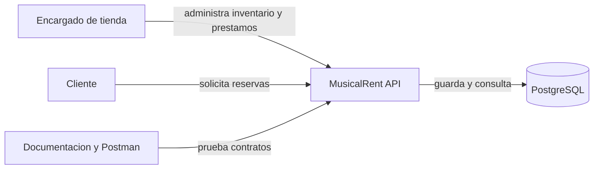

### 35.2 Diagrama de casos de uso

Pregunta que responde: quien puede hacer que?

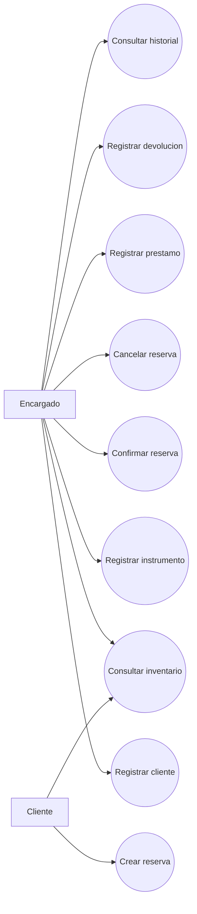

### 35.3 Diagrama de componentes

Pregunta que responde: que partes de software se comunican?

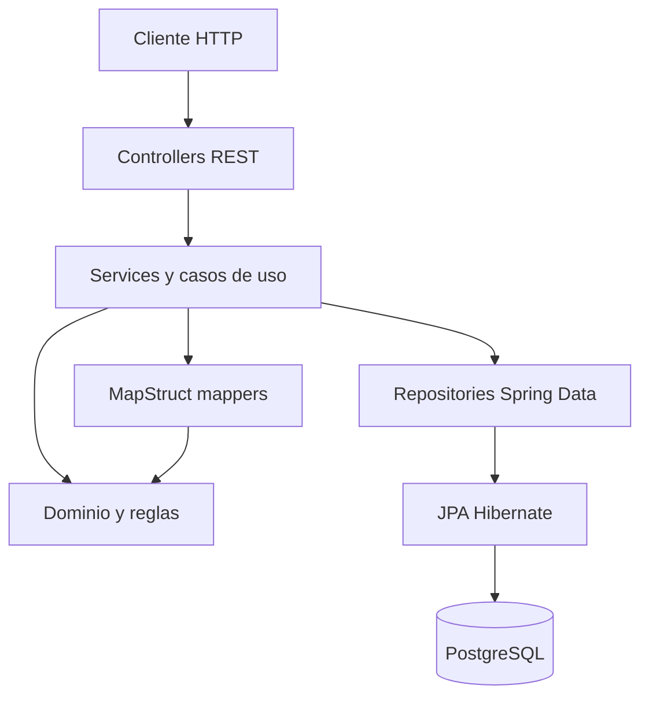

### 35.4 Diagrama de paquetes

Pregunta que responde: como se organiza el codigo?

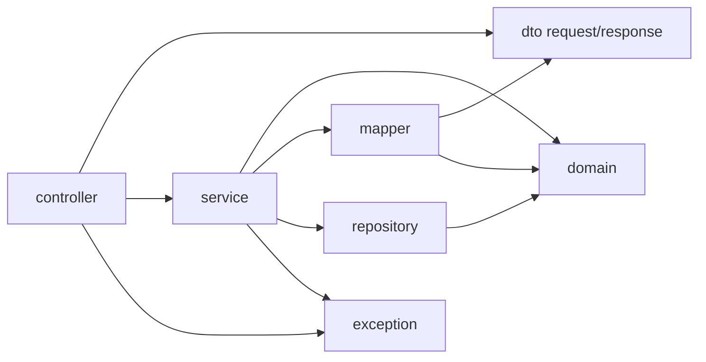

### 35.5 Diagrama de clases del dominio

Pregunta que responde: que objetos existen y como se relacionan?

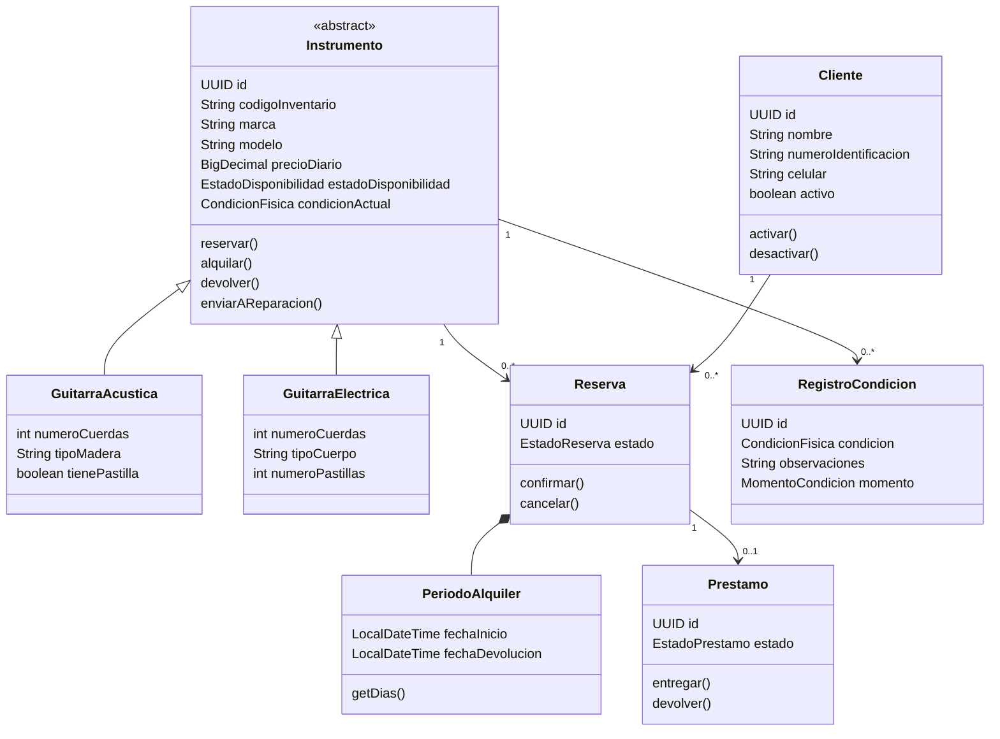

### 35.6 Diagrama entidad-relacion

Pregunta que responde: como se almacenan los datos?

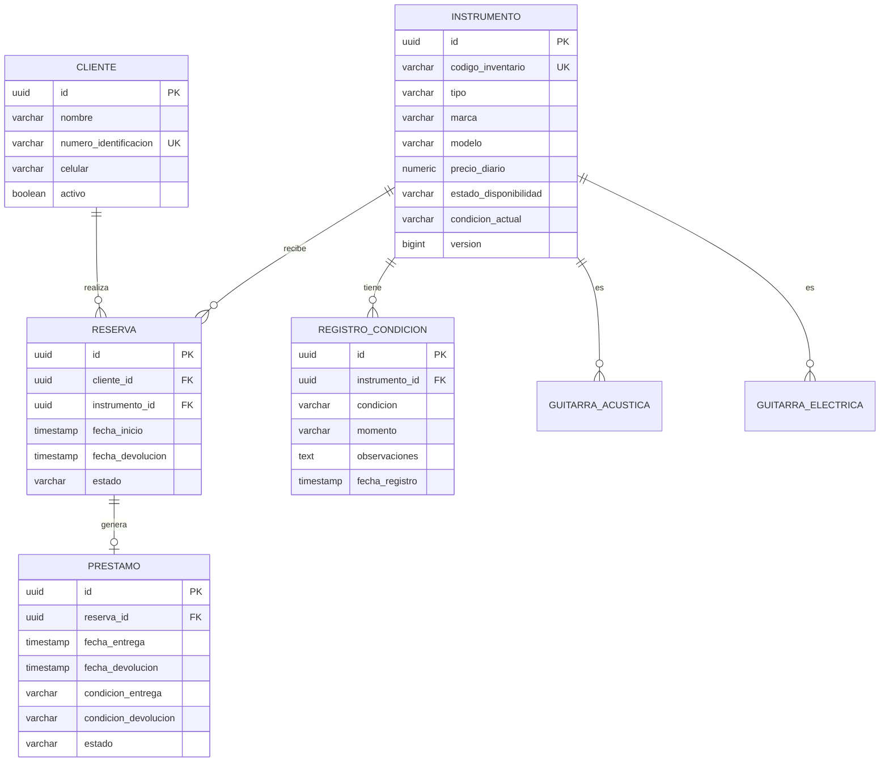

### 35.7 Diagrama de secuencia: crear reserva

Pregunta que responde: en que orden colaboran las partes?

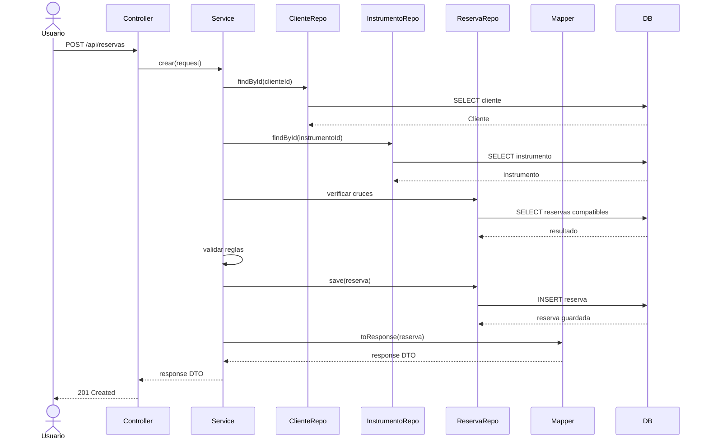

### 35.8 Diagrama de secuencia: devolucion

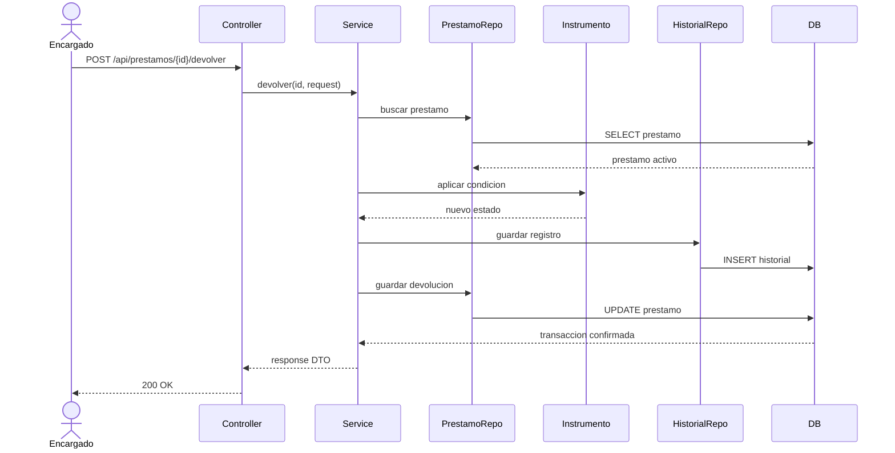

### 35.9 Diagrama de estados del instrumento

Pregunta que responde: que estados existen y que transiciones son validas?

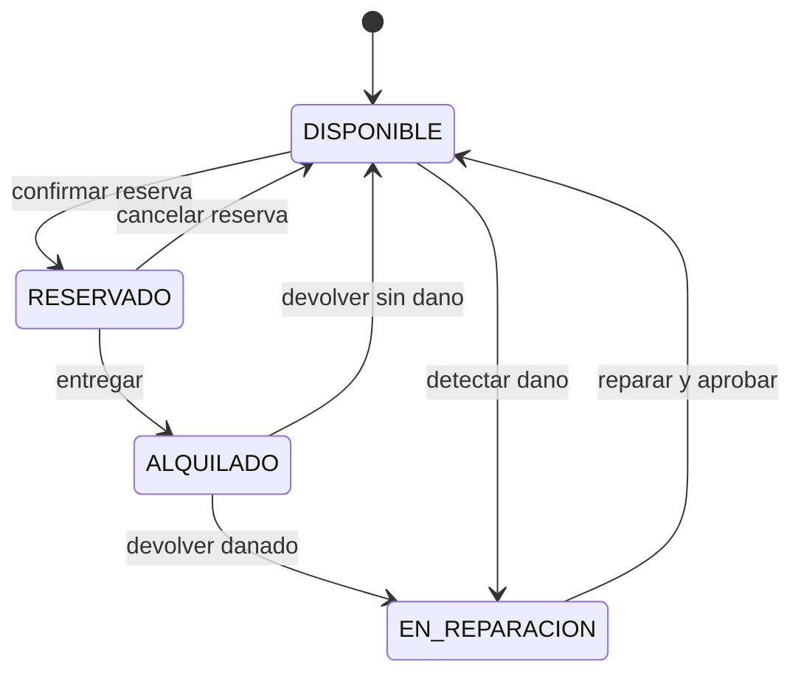

### 35.10 Diagrama de actividad: reservar instrumento

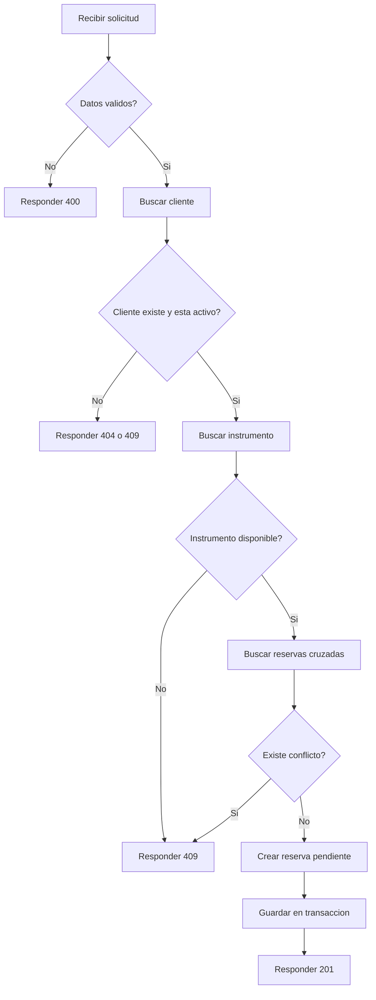

### 35.11 Diagrama de despliegue

Pregunta que responde: donde se ejecutan las piezas?

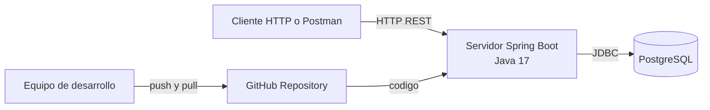

### 35.12 Diagrama de componentes de entrega

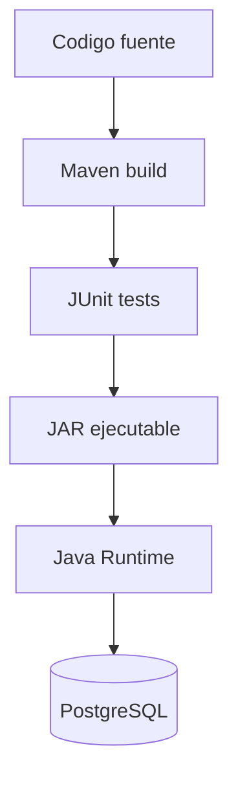

### 35.13 Diagrama de trazabilidad

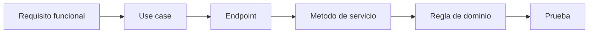

---

## 36. Modelo de datos relacional

### 36.1 Tabla `cliente`

| Columna | Tipo | Restriccion | Significado |
|---|---|---|---|
| `id` | UUID | PK | Identificador |
| `nombre` | VARCHAR | NOT NULL | Nombre visible |
| `numero_identificacion` | VARCHAR | UNIQUE, NOT NULL | Identidad del cliente |
| `celular` | VARCHAR | NOT NULL | Contacto |
| `email` | VARCHAR | Opcional o unico segun decision | Contacto digital |
| `activo` | BOOLEAN | NOT NULL | Permite reservar |

### 36.2 Tabla `instrumento`

| Columna | Tipo | Restriccion | Significado |
|---|---|---|---|
| `id` | UUID | PK | Identificador |
| `codigo_inventario` | VARCHAR | UNIQUE, NOT NULL | Codigo interno |
| `marca` | VARCHAR | NOT NULL | Fabricante |
| `modelo` | VARCHAR | NOT NULL | Modelo |
| `precio_diario` | NUMERIC | NOT NULL | Tarifa |
| `estado_disponibilidad` | VARCHAR | NOT NULL | Estado operativo |
| `condicion_actual` | VARCHAR | NOT NULL | Estado fisico |
| `version` | BIGINT | NOT NULL | Concurrencia |

### 36.3 Tablas de herencia

`guitarra_acustica` y `guitarra_electrica` usan el mismo `id` de `instrumento` como clave primaria y foranea.

Esto permite guardar los datos comunes una sola vez y los datos especificos en la tabla del subtipo.

### 36.4 Reglas de integridad

- Claves primarias no nulas.
- Codigos unicos.
- Identificaciones unicas.
- Relaciones con claves foraneas.
- Estados guardados como texto.
- Dinero con precision decimal.
- Fechas con semantica documentada.

---

## 37. Contratos de la API REST

Los contratos se deben definir antes de programar los controllers.

### 37.1 Crear cliente

```http
POST /api/clientes
Content-Type: application/json
```

```json
{
  "nombre": "Laura Gomez",
  "numeroIdentificacion": "123456789",
  "celular": "3001234567",
  "email": "laura@example.com"
}
```

Respuesta `201 Created`:

```json
{
  "id": "uuid",
  "nombre": "Laura Gomez",
  "numeroIdentificacion": "123456789",
  "celular": "3001234567",
  "activo": true
}
```

### 37.2 Crear instrumento acustico

```http
POST /api/instrumentos
Content-Type: application/json
```

```json
{
  "tipo": "GUITARRA_ACUSTICA",
  "codigoInventario": "GTR-001",
  "marca": "Yamaha",
  "modelo": "FG800",
  "precioDiario": 25000,
  "numeroCuerdas": 6,
  "tipoMadera": "ABETO",
  "tienePastilla": false
}
```

### 37.3 Crear reserva

```http
POST /api/reservas
Content-Type: application/json
```

```json
{
  "clienteId": "uuid",
  "instrumentoId": "uuid",
  "fechaInicio": "2026-10-10T09:00:00",
  "fechaDevolucion": "2026-10-15T17:00:00"
}
```

### 37.4 Actualizacion parcial

```http
PATCH /api/instrumentos/{id}
Content-Type: application/json
```

```json
{
  "precioDiario": 30000,
  "condicionActual": "RAYADO"
}
```

El servidor no debe cambiar marca, modelo ni codigo si no fueron enviados.

### 37.5 Formato de error

```json
{
  "timestamp": "2026-10-02T10:00:00Z",
  "status": 409,
  "error": "CONFLICT",
  "message": "El instrumento ya esta reservado para ese periodo",
  "path": "/api/reservas"
}
```

---

## 38. Flujos de negocio

### 38.1 Alta de instrumento

1. El usuario envia request con `tipo`.
2. Spring convierte JSON a DTO.
3. Bean Validation revisa formato.
4. El Service aplica reglas.
5. El Mapper decide el subtipo.
6. El constructor del dominio valida invariantes.
7. El Repository guarda la entidad.
8. Se crea condicion inicial.
9. El Mapper crea la respuesta.
10. Controller responde `201`.

### 38.2 Reserva

1. Recibir cliente, instrumento y fechas.
2. Buscar cliente.
3. Verificar que este activo.
4. Buscar instrumento.
5. Verificar que no este en reparacion.
6. Buscar reservas que se crucen.
7. Crear reserva pendiente.
8. Guardar dentro de una transaccion.
9. Devolver resumen de cliente e instrumento.

### 38.3 Confirmacion

1. Buscar reserva.
2. Verificar que pueda confirmarse.
3. Verificar disponibilidad nuevamente.
4. Cambiar reserva a confirmada.
5. Cambiar instrumento a reservado.
6. Guardar ambos cambios atomically.
7. Devolver respuesta.

### 38.4 Entrega

1. Buscar reserva confirmada.
2. Verificar que no exista prestamo activo.
3. Capturar condicion de entrega.
4. Crear prestamo activo.
5. Cambiar instrumento a alquilado.
6. Crear registro de condicion.
7. Guardar en transaccion.

### 38.5 Devolucion

1. Buscar prestamo activo.
2. Capturar condicion de devolucion.
3. Registrar observaciones.
4. Crear evento historico.
5. Cambiar prestamo a devuelto.
6. Cambiar instrumento a disponible o reparacion.
7. Guardar en transaccion.

### 38.6 Regla de cruce de fechas

Dos periodos se cruzan cuando:

```text
nuevoInicio < existenteFin
Y
nuevoFin > existenteInicio
```

Esta formula debe probarse con:

- Periodos completamente separados.
- Mismo inicio.
- Misma devolucion.
- Un periodo contenido en otro.
- Periodos adyacentes.
- Fechas iguales.

---

## 39. Seguridad y confiabilidad

### 39.1 Datos que no deben recibirse desde el cliente

No permitir que el request controle:

- `id`.
- `version`.
- Fecha de registro.
- Historial.
- Estado interno si la transicion requiere una accion.
- Relaciones completas.

### 39.2 Datos sensibles

- No guardar contrasenas en Git.
- No registrar tokens en logs.
- No devolver informacion innecesaria.
- Usar variables de entorno para PostgreSQL.
- Mantener `.env` fuera del repositorio si se usa.

### 39.3 Concurrencia

Dos solicitudes pueden intentar alquilar el mismo instrumento. Para reducir el riesgo:

1. Usar transacciones.
2. Revisar disponibilidad dentro de la transaccion.
3. Usar `@Version`.
4. Considerar bloqueos de base de datos si el alcance lo requiere.
5. Probar dos operaciones concurrentes.

### 39.4 Integridad de dinero

Usar `BigDecimal` y definir:

- Escala.
- Redondeo.
- Moneda.
- Momento del calculo.

### 39.5 Integridad de estados

No utilizar un setter generico como `setEstado`. Preferir metodos que expresen una accion:

```text
reservar()
alquilar()
devolver()
enviarAReparacion()
reparar()
```

Cada metodo debe rechazar transiciones imposibles.

---

## 40. Estrategia de pruebas

### 40.1 Piramide de pruebas

```text
      /\\
     / E2E \\
    /-------\\
     / Integr. \\
    /-----------\\
   / Unitarias   \\
  /---------------\\
```

La mayor cantidad debe estar en pruebas unitarias, una cantidad intermedia en integracion y pocas pruebas end-to-end.

### 40.2 Pruebas unitarias de dominio

Probar sin Spring ni PostgreSQL:

- Cliente invalido.
- Cliente inactivo.
- Precio negativo.
- Fechas invalidas.
- Transicion disponible a reservado.
- Transicion reservado a alquilado.
- Devolucion danada.
- Condicion registrada.

### 40.3 Pruebas de mapper

- Request acustico crea `GuitarraAcustica`.
- Request electrico crea `GuitarraElectrica`.
- La respuesta conserva `tipo`.
- Los campos especificos no se pierden.
- PATCH con null conserva valores anteriores.

### 40.4 Pruebas de servicio

Usar mocks para repositorios y comprobar:

- Que se consultan dependencias.
- Que se lanzan excepciones.
- Que se guarda la entidad correcta.
- Que se respetan transacciones conceptualmente.

### 40.5 Pruebas de repository

Comprobar:

- Busqueda por codigo.
- Busqueda por identificacion.
- Reservas cruzadas.
- Prestamos activos.
- Instrumentos por estado.

### 40.6 Pruebas de controller

Comprobar:

- URL.
- Metodo HTTP.
- JSON.
- Validacion.
- Codigo de estado.
- Formato de error.

### 40.7 Pruebas de integracion

Probar el camino completo con una base de datos de prueba:

```text
HTTP -> Controller -> Service -> Repository -> DB
```

### 40.8 Definition of Done de una funcionalidad

Una funcionalidad no esta terminada hasta tener:

- Requisito escrito.
- Regla de negocio escrita.
- Entidad o DTO necesario.
- Servicio.
- Endpoint si aplica.
- Validacion.
- Excepcion.
- Mapper.
- Prueba.
- Ejemplo JSON.
- Documentacion actualizada.

---

## 41. Reglas para documentar el codigo

### 41.1 Antes de agregar una clase

Documentar:

1. Que concepto representa.
2. Por que existe.
3. En que paquete vive.
4. Que responsabilidad tiene.
5. Que clases utiliza.
6. Que reglas protege.

### 41.2 Antes de agregar un atributo

Responder:

- Que significa.
- Si es obligatorio.
- Quien lo puede modificar.
- Donde se persiste.
- Como se valida.
- Si se muestra en request.
- Si se muestra en response.

### 41.3 Antes de agregar un metodo

Documentar:

- Que accion representa.
- Que precondiciones necesita.
- Que cambia.
- Que excepciones puede producir.
- Que resultado entrega.
- Que prueba demuestra su comportamiento.

### 41.4 Antes de eliminar algo

Explicar:

- Por que ya no es necesario.
- Que requisitos afectaba.
- Que pruebas se actualizan.
- Que documentacion se corrige.

### 41.5 Comentarios de codigo

Los comentarios deben explicar el motivo de una decision, no repetir lo que el codigo ya dice.

Malo:

```java
// Incrementa contador
contador++;
```

Mejor:

```java
// Tres penalizaciones desactivan al cliente para impedir nuevos prestamos.
contador++;
```

---

## 42. Plan de ejecucion didactico

Cada sesion de trabajo debe seguir este formato.

### Paso A: objetivo

Escribir en una frase que se va a aprender y construir.

### Paso B: teoria minima

Explicar cada palabra nueva:

- Clase.
- Entidad.
- DTO.
- Mapper.
- Repository.
- Service.
- Controller.
- Anotacion.
- Transaccion.

### Paso C: archivo

Indicar:

- Ruta.
- Nombre.
- Motivo del paquete.
- Responsabilidad.

### Paso D: codigo pequeno

Escribir solo la parte de la fase actual.

### Paso E: prueba

Ejecutar la validacion mas pequena posible.

### Paso F: reflexion

Responder:

- Que funciono.
- Que significa el resultado.
- Que error apareceria si se elimina la parte nueva.

### Paso G: commit

Hacer un commit pequeno y descriptivo.

### Paso H: documentacion

Actualizar este archivo con la decision aprendida.

### Orden exacto de construccion

1. Crear el proyecto base.
2. Verificar que inicia.
3. Crear enums.
4. Crear `PeriodoAlquiler`.
5. Crear `Cliente`.
6. Crear `Instrumento` abstracto.
7. Crear los subtipos.
8. Crear `Reserva`.
9. Crear `Prestamo`.
10. Crear historial.
11. Crear repositorios.
12. Crear DTOs de cliente.
13. Crear DTOs polimorficos.
14. Crear responses anidados.
15. Crear mappers.
16. Crear servicios.
17. Crear controllers.
18. Agregar validacion.
19. Agregar excepciones.
20. Agregar PATCH.
21. Agregar filtros.
22. Agregar pruebas.
23. Documentar y presentar.

---

## 43. Trazabilidad y calidad

### 43.1 Matriz de trazabilidad

| Requisito | Caso de uso | Clase o endpoint | Prueba | Estado |
|---|---|---|---|---|
| RF-001 | CU-001 | `POST /api/clientes` | Cliente valido | Pendiente |
| RF-003 | CU-003 | `POST /api/instrumentos` | Mapper polimorfico | Pendiente |
| RF-005 | CU-005 | `POST /api/reservas` | Reserva sin cruces | Pendiente |
| RF-006 | CU-006 | `/confirmar` | Cambio de estado | Pendiente |
| RF-008 | CU-008 | `POST /api/prestamos` | Entrega | Pendiente |
| RF-009 | CU-009 | `/devolver` | Devolucion danada | Pendiente |
| RF-010 | CU-010 | `/historial-condiciones` | Historial | Pendiente |
| RF-011 | CU-011 | `PATCH /api/instrumentos/{id}` | Null ignore | Pendiente |

Estados permitidos:

```text
Pendiente
En progreso
Bloqueado
Terminado
Verificado
```

### 43.2 Checklist antes de integrar una rama

- [ ] El cambio tiene una tarea o requisito.
- [ ] El codigo compila.
- [ ] Las pruebas pasan.
- [ ] No hay credenciales.
- [ ] No se modifican archivos ajenos sin motivo.
- [ ] Se actualizo este documento.
- [ ] El commit tiene mensaje claro.
- [ ] El integrante puede explicar su cambio.

### 43.3 Checklist de revision de codigo

- [ ] Nombres claros.
- [ ] Metodos pequenos.
- [ ] No hay logica de negocio en controller.
- [ ] No se exponen entidades.
- [ ] No hay setters peligrosos.
- [ ] Las excepciones son claras.
- [ ] Las relaciones JPA son intencionales.
- [ ] Los mappers no tienen advertencias relevantes.
- [ ] Existe prueba para la regla nueva.
- [ ] La documentacion coincide con la implementacion.

### 43.4 Checklist de entrega

- [ ] README completo.
- [ ] Instalacion documentada.
- [ ] Variables de entorno documentadas.
- [ ] Base de datos explicada.
- [ ] Endpoints documentados.
- [ ] Ejemplos JSON.
- [ ] Diagramas renderizables.
- [ ] Pruebas ejecutadas.
- [ ] Coleccion Postman.
- [ ] Reparto de integrantes.
- [ ] Limitaciones declaradas.
- [ ] Repositorio actualizado.

---

## 44. Glosario

### API

Interfaz que permite que otros programas se comuniquen con el sistema.

### REST

Estilo de construccion de APIs usando recursos, URLs y metodos HTTP.

### Entidad

Objeto del dominio que tiene identidad y normalmente se persiste.

### DTO

Objeto usado para transportar datos entre capas o por la red.

### Request

Datos que entran a la API.

### Response

Datos que salen de la API.

### Mapper

Componente que transforma un objeto en otro.

### Repository

Abstraccion para consultar y guardar datos.

### Service

Capa que coordina un caso de uso.

### Controller

Capa que recibe peticiones HTTP.

### Dominio

Reglas y conceptos propios del negocio.

### Invariante

Regla que siempre debe mantenerse verdadera.

### Polimorfismo

Capacidad de tratar objetos concretos mediante una referencia comun.

### Herencia

Relacion en la que una clase especializada reutiliza y amplia una clase general.

### Abstraccion

Representacion de lo esencial ocultando detalles innecesarios.

### Encapsulamiento

Proteccion del estado interno y control de como se modifica.

### ORM

Tecnica para mapear objetos a tablas relacionales.

### JPA

Especificacion de Java para persistencia de objetos.

### Hibernate

Implementacion de JPA utilizada por Spring Boot.

### Transaccion

Unidad de trabajo que debe completarse completa o revertirse.

### Proyeccion

Respuesta que selecciona solo los datos necesarios.

### PATCH

Metodo HTTP para actualizar parcialmente un recurso.

### Idempotencia

Propiedad por la que repetir una operacion produce el mismo resultado esperado.

### DTO anidado

DTO que contiene otros DTOs resumidos.

### Migracion

Cambio controlado de la estructura de la base de datos.

### Concurrencia

Situacion en la que varias operaciones ocurren al mismo tiempo.

---

## 45. Registro de decisiones

Este registro debe crecer durante el proyecto.

### ADR-001: arquitectura por capas

Estado: aceptada.

Contexto: se necesita separar HTTP, reglas y persistencia.

Decision: usar Controller, Service, Repository, Domain, DTO y Mapper.

Consecuencia: mas archivos, pero responsabilidades claras y pruebas mas sencillas.

### ADR-002: DTOs en lugar de entidades en la API

Estado: aceptada.

Contexto: las entidades contienen relaciones y detalles internos.

Decision: los controllers reciben y devuelven DTOs.

Consecuencia: se requiere MapStruct y mas clases, pero se protege el contrato.

### ADR-003: herencia `JOINED`

Estado: aceptada.

Contexto: existen atributos comunes y especificos de cada guitarra.

Decision: usar una tabla padre y tablas por subtipo.

Consecuencia: el modelo relacional representa el polimorfismo, aunque algunas consultas son mas complejas.

### ADR-004: `BigDecimal` para dinero

Estado: aceptada.

Contexto: el precio debe conservar exactitud decimal.

Decision: no usar `double` para valores monetarios.

Consecuencia: se debe definir escala y redondeo.

### ADR-005: historial inmutable

Estado: aceptada.

Contexto: el estado actual no explica que ocurrio antes.

Decision: cada cambio de condicion crea un registro nuevo.

Consecuencia: se consume mas almacenamiento, pero se conserva trazabilidad.

---

## 46. Registro de cambios del documento

| Fecha | Cambio | Responsable |
|---|---|---|
| 2026-10-02 | Se amplia el plan con especificacion, diagramas, contratos y trazabilidad | Equipo |

Cada modificacion futura debe agregar una fila.

---

## 47. Estado documental actual

- [x] Idea del proyecto documentada.
- [x] Integrantes documentados.
- [x] Alcance inicial definido.
- [x] Arquitectura propuesta.
- [x] Modelo de dominio propuesto.
- [x] Endpoints iniciales propuestos.
- [x] Reglas de negocio iniciales.
- [x] Diagramas principales incluidos.
- [x] Estrategia de pruebas incluida.
- [x] Reglas de documentacion incluidas.
- [x] Matriz de trazabilidad inicial incluida.
- [x] Decisiones arquitectonicas iniciales incluidas.
- [ ] Requisitos aprobados por el equipo.
- [ ] Diagramas revisados por el equipo.
- [ ] Proyecto Spring Boot creado.
- [ ] Base de datos configurada.
- [ ] Codigo implementado.
- [ ] Pruebas ejecutadas.
- [ ] README de instalacion terminado.
- [ ] Presentacion preparada.

## 48. Primer trabajo despues de esta documentacion

No crear codigo inmediatamente.

El equipo debe reunirse y validar:

1. Si los nombres de las entidades son correctos.
2. Si `Reserva` y `Prestamo` deben ser objetos separados.
3. Si se aceptan guitarras acusticas y electricas como primer alcance.
4. Que significa exactamente cada estado.
5. Que ocurre cuando una guitarra vuelve danada.
6. Si el cliente puede cancelar una reserva.
7. Si se requiere login en el MVP.
8. Si los precios se expresan en pesos colombianos.
9. Si las fechas se manejan con hora o solo con dia.
10. Si los diagramas representan el acuerdo real del equipo.

Cuando esas respuestas esten aprobadas, se crea el proyecto base y se inicia la primera fase de codigo: enums y objetos de valor.
